# 000 — Setup

You are a Saiyan captive in the Obsidian Circuit: an interstellar gladiatorial economy that sells pain as entertainment.

You’ve survived one year in the pits—long enough to learn the rules that aren’t written down: the collars bite, the odds lie, and mercy is a currency you rarely get to spend.

**Now Playing**
- **Location**: Obsidian Pits — Holding Cells (Under-Arena)
- **HP**: 32
- **Fatigue**: 5
- **Hunger**: 3
- **XP**: 12

## Canon Questions (Answer In-Character Or OOC)
- Do you still have your tail? (bound/clamped vs removed)
- What’s your name (or what do they call you in the pits)?
- What’s your signature “tell” when you’re about to explode into action?

---
## Turn — 2025-12-23 22:44
### Scene
**Hard frame:** You’re in the [[worlds/Obsidian_Circuit/lore/locations/Obsidian_Pits.md]]—under-arena holding cells—where the stone is colder than space and the air tastes like pennies.

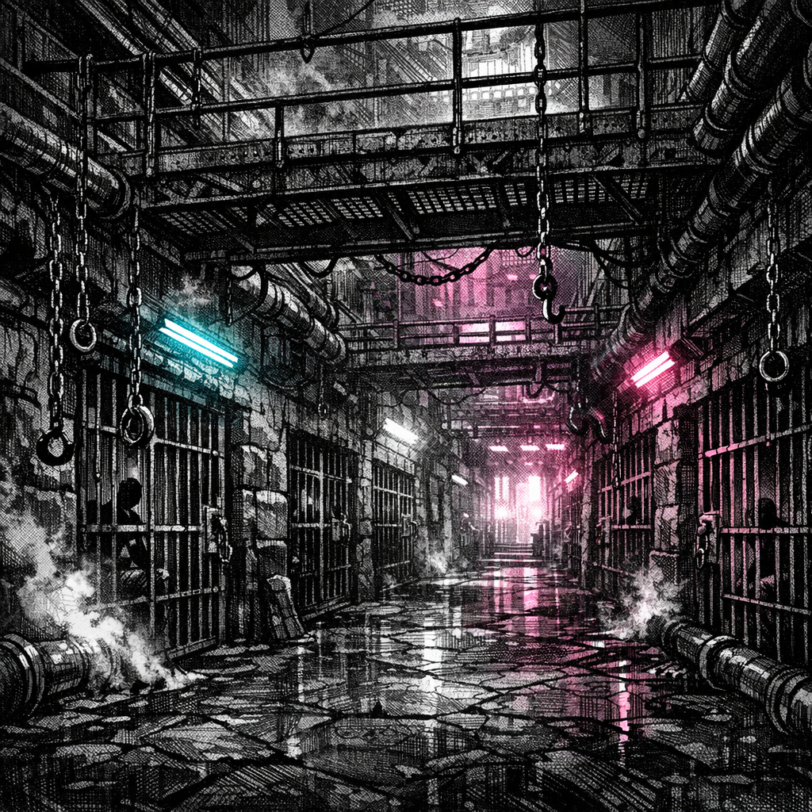

The **[[worlds/Obsidian_Circuit/lore/items/K-Chain_Shock_Collar.md|K-Chain Shock Collar]]** sits heavy at your throat. It doesn’t just *weigh*—it *listens*. Every time your ki rises on instinct, the collar answers with a thin static itch that crawls under your skin like ants.

Tonight, the corridor is louder than usual. Boots on catwalk grates. A muffled roar above, like a storm trapped in a dome.

Then the bell hits.

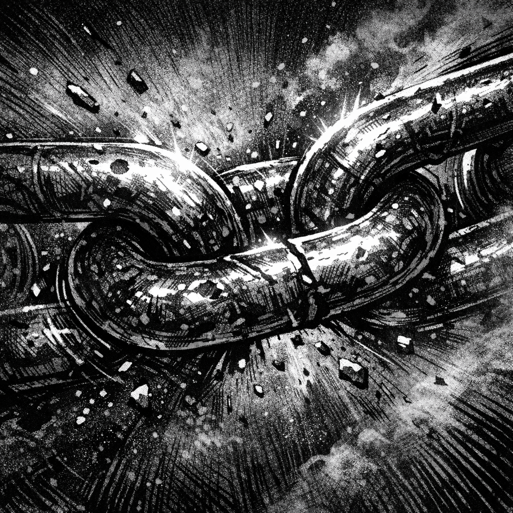

Not a chime—an impact. The sound rolls through the walls and into your teeth. Across the cells, prisoners go still the way prey goes still: hoping movement won’t make them the choice.

A line of guards in matte helmets stops at your bars. Their prods crackle blue-white, the smell of ozone sharpening the air. Behind them glides [[worlds/Obsidian_Circuit/lore/characters/Pitmaster_Veyl.md|Pitmaster Veyl]]—clean gloves, mirrored respirator, that lacquer-black coat stitched in sickly gold.

“Asset,” Veyl says, voice soft enough to make it intimate. “One year. Still breathing. The [[worlds/Obsidian_Circuit/lore/factions/Obsidian_Circuit.md|Obsidian Circuit]] loves a stubborn story.”

The collar warms—just a warning pulse—and you understand the message: **tonight isn’t a routine bout.**

Veyl tilts their head as if listening to a distant crowd chant you can’t hear yet. “Before we open the gate,” they add, “I want to know what to call you when you disappoint me.”

The guard nearest you hooks a chain through the bars and gives it a testing tug, like measuring how much of you will follow it.
### Your Options
1. Play it cold and compliant—save your ki for the sand (d20 + Strength + Brawling).
2. Scout: read guards, exits, and Veyl’s tells before you move (d20 + Intellect + Perception).
3. Test the collar: micro-burst ki control to map its threshold without triggering a full shock (d20 + Ki Control + Survival).
4. Talk back—turn the crowd’s hunger into leverage, demand terms or a weapon (d20 + Strength + Intimidation).
5. Go for it: attempt an escape into the catwalk/vent network when the gate cycle starts (d20 + Agility + Athletics).

### What Changed
- Clock: matchmaker_bell advances 4/6 → 5/6.
- Fatigue +1 (forced wake-up and pre-fight handling).
- New pressure: Pitmaster Veyl is personally present.

Mechanics

**Core roll**: `d20 + stat + skill` vs DC.

**Option DCs (baseline)**
- **1 (Compliant / conserve)**: DC 12 (avoid provoking a shock response while staying ready).
- **2 (Scout)**: DC 13 (spot an exit pattern / hidden restraint protocol).
- **3 (Collar threshold test)**: DC 15 (success = learn the “yellow line”; fail = partial shock + alertness tick).
- **4 (Leverage / terms)**: DC 14 (success = small concession; fail = collar warning + guard hostility).
- **5 (Escape attempt)**: DC 17 (success = break contact; fail = immediate stun + lockdown).

**World clocks (current)**
- `matchmaker_bell`: 5/6 (gate call is imminent)
- `guard_alertness`: 2/6
- `hunger`: 3/6
- `rumor_of_vegeta`: 1/6

---
## Turn — 2025-12-23 23:35
### Scene
You let the silence stretch—long enough for the guards to shift their weight, long enough for the chain to stop pretending it isn’t a leash.

Your mouth curls.

“I am violence.”

The words hit the corridor like a thrown stone. Somewhere down the line, a prisoner exhales like they’ve been holding their breath for hours.

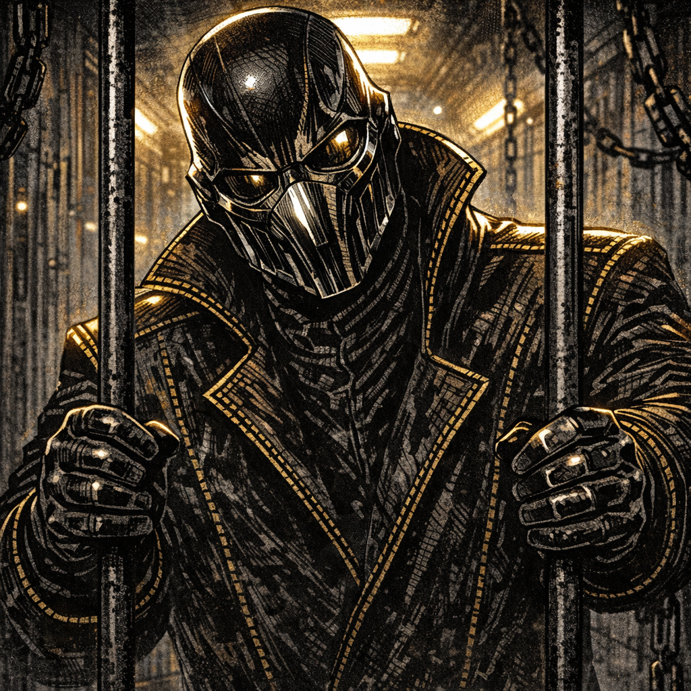

[[worlds/Obsidian_Circuit/lore/characters/Pitmaster_Veyl.md|Pitmaster Veyl]] doesn’t flinch. Their head tilts a fraction, the mirrored respirator plate catching the fluorescents and throwing your reflection back at you in thin, broken slices.

“Violence,” Veyl repeats, as if tasting a vintage. “A *claim*. Or a *name*.”

The guard at your bars tightens the chain one link.

The collar answers before you do—warming at the seam, a warning that crawls under your skin.

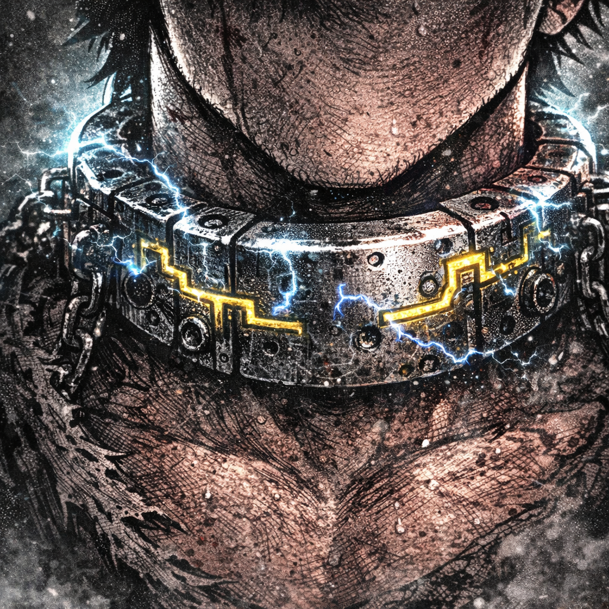

Blue static needles your throat. Not the full bite—just the promise of it. Veyl’s gloved thumb rests on the remote like a question mark.

Above, the crowd surges. You feel it through the stone: stamping feet, a chant turning into a single hungry animal.

The bell hits again.

This time, the corridor lights stutter—and the far gate begins to open.

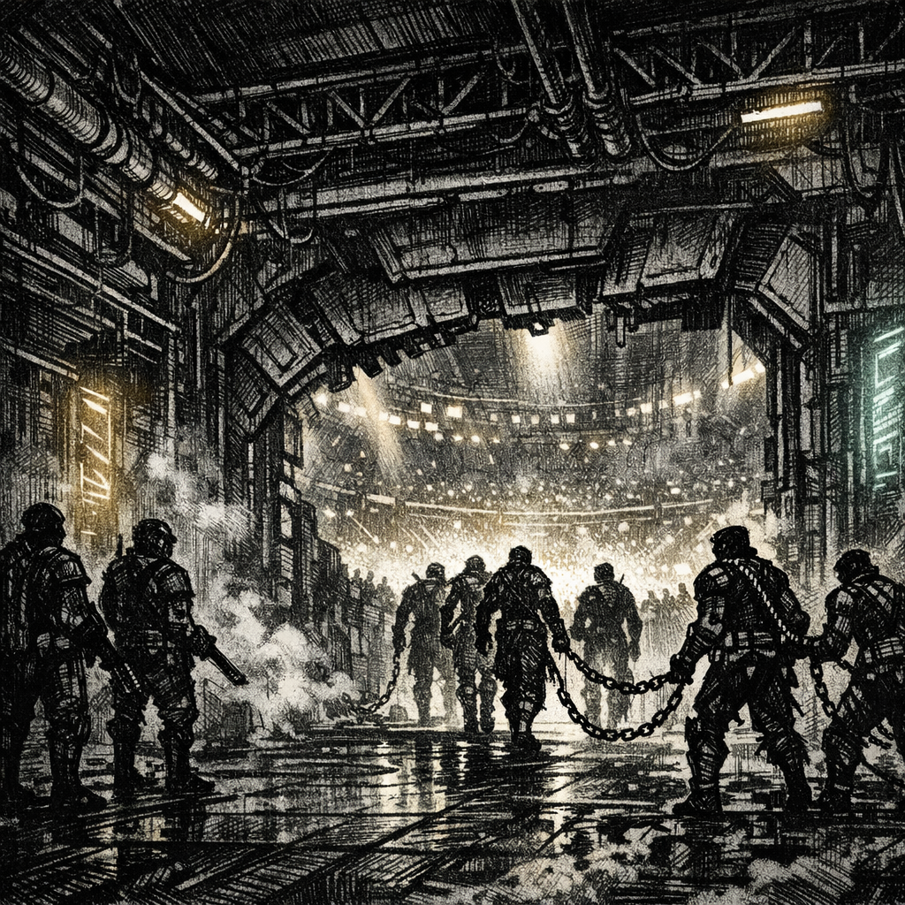

A seam of arena-light spills into the under-dark. Hot. Bright. Cruel. The smell changes first: sand, sweat, scorched metal.

Veyl leans closer, voice for you alone. “If you want the Circuit to *say* your name… you earn it. If you want to keep your throat intact… you choose your next breath carefully.”
### Your Options
1. Make it official: demand the announcer calls you **Violence**—and accept whatever “price” Veyl names (d20 + Strength + Intimidation).
2. Play it tactical: give a fake name, keep Violence as your private vow, and watch Veyl’s tells (d20 + Intellect + Perception).
3. Test boundaries: hold eye contact and deliberately raise ki a hair—dare the collar to prove it owns you (d20 + Ki Control + Survival).
4. Switch the angle: bargain for a weapon/gear concession in exchange for a dramatic opening (d20 + Intellect + Intimidation).
5. Save it for the sand: nod, conserve, and focus on reading the gate sequence for an escape window (d20 + Agility + Athletics).

### What Changed
- Clock: matchmaker_bell advances 5/6 → 6/6 (gate cycle begins).
- Clock: guard_alertness advances 2/6 → 3/6 (provoked attention).
- Pressure: collar warning threshold lowered for the next few minutes.

Mechanics

**Core roll**: `d20 + stat + skill` vs DC.

**Fictional positioning**
- Your declaration (“I am violence.”) puts you on Veyl’s radar: higher risk, higher leverage.
- Until the gate closes behind you, the collar is “hair-trigger” (failures involving ki/intimidation may add a shock complication).

**Option DCs (baseline)**
- **1 (Demand the name)**: DC 15 (success = crowd-branding; fail = collar punishment / terms worsen).
- **2 (Fake name + read tells)**: DC 13 (success = learn Veyl’s angle; fail = you miss a key tell).
- **3 (Ki dare)**: DC 16 (success = map threshold; fail = partial shock + alertness tick).
- **4 (Gear bargain)**: DC 15 (success = small concession; fail = immediate refusal + collar warning).
- **5 (Conserve + watch gate)**: DC 14 (success = spot a timing gap; fail = you’re chained tighter at rollout).

---
## Turn — 2025-12-23 23:48
### Scene
**Hard frame:** The gate seam is open now—just a blade of arena-light cutting the under-dark. It turns dust into glitter and makes every chain-link look like a tooth.

You hold [[worlds/Obsidian_Circuit/lore/characters/Pitmaster_Veyl.md|Pitmaster Veyl]]’s reflection in their respirator and don’t blink.

“I am Violence,” you say again—slower this time, like you’re carving it into stone. “This pit has taken all else.”

You lean into the collar’s weight, let it feel your pulse.

“When is my next fight?” Your voice comes out dry. “I yearn for the arena.”

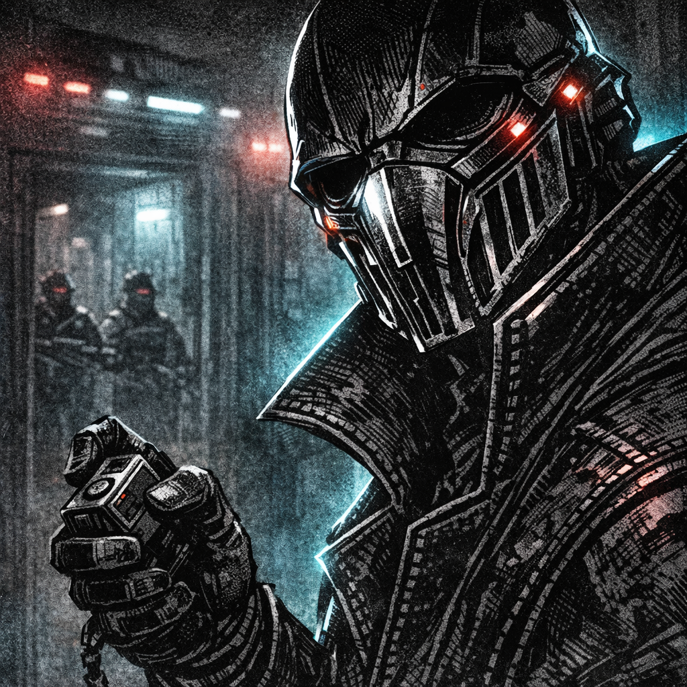

Veyl’s head tilts, a precise angle—curiosity dressed up as control. Their gloved thumb taps the remote once, not to shock you, but to remind you it *can*.

“A schedule,” Veyl murmurs. “You still believe in *time*.”

They gesture with two fingers. The guards move as one: the chain goes taut, your shoulders yank forward, and the collar warms—yellow-line hot—until you taste copper.

“Your next fight is not a date,” Veyl says as they walk beside you. “It’s a door.”

The bell hits again overhead—closer now, louder—followed by the crowd’s roar rolling down the tunnel like a pressure wave.

“And it’s opening.”

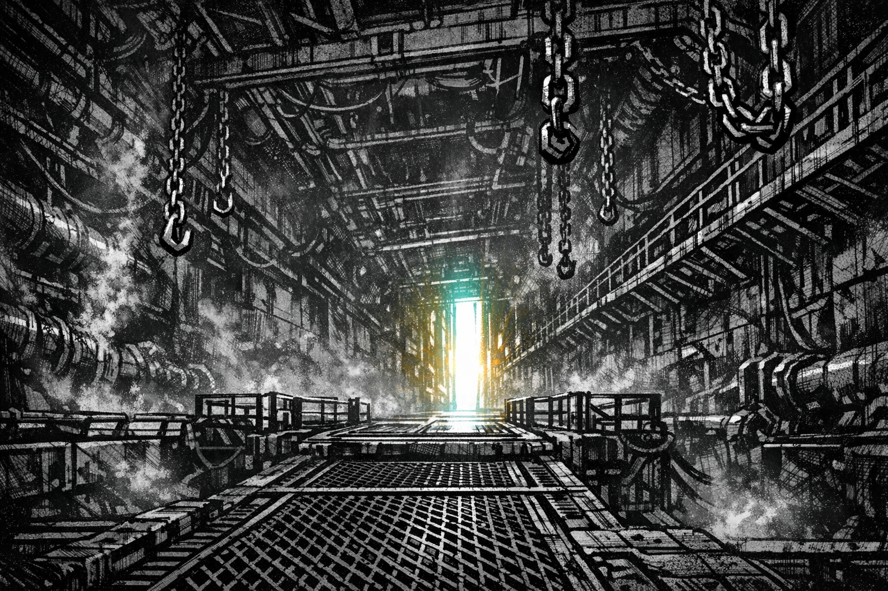

The corridor bends. Heat pours in from ahead, washing over your skin in dry waves. The air changes—sand, sweat, scorched metal—so thick you can almost chew it.

Ahead: a grated ramp, a lift platform, a slit of blinding white. A handler’s voice barks numbers you don’t recognize. Chains clatter into new hooks.

Veyl keeps pace, close enough that you catch the faint, antiseptic bite of their gloves. “You get one question before the sand,” they add, soft as a gift. “Choose it well.”

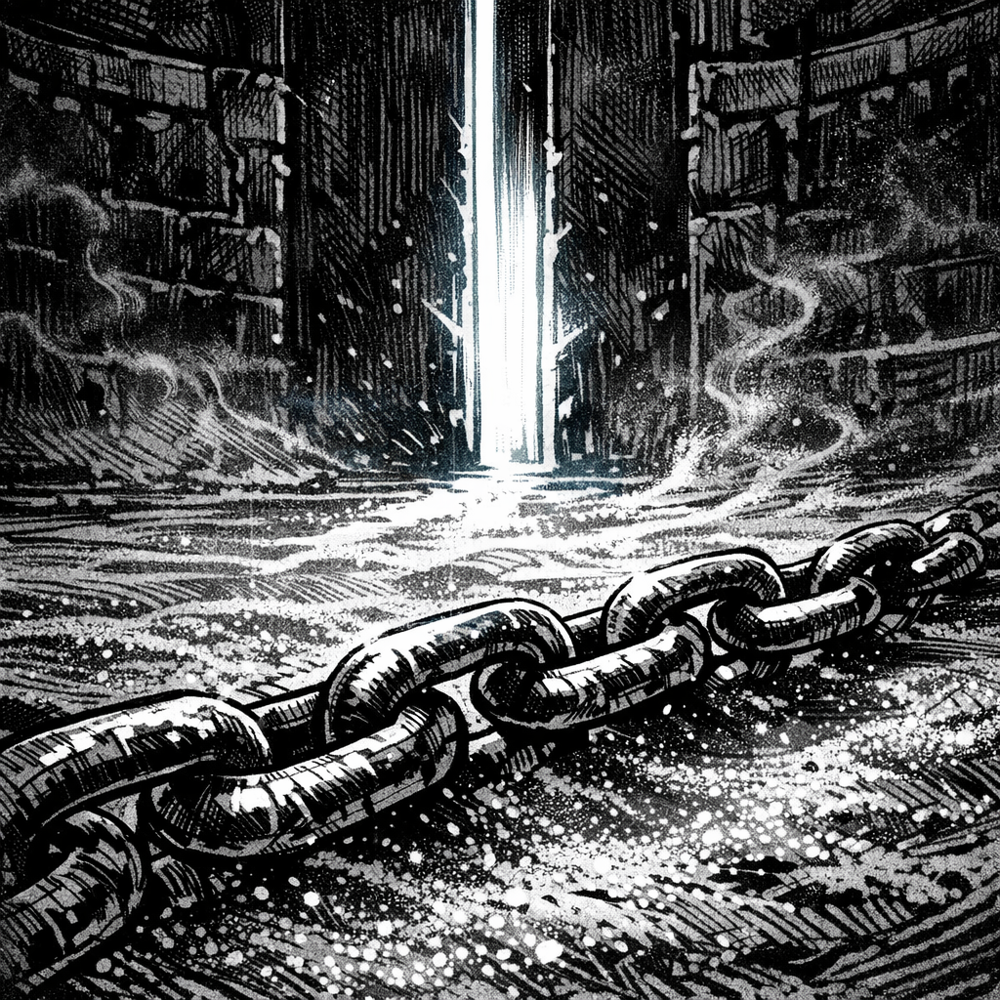

Beyond the threshold you glimpse it: a bowl of black stone and screaming light, the arena floor like a pale wound under spotlamps. Somewhere out there, something heavy lands once—*thump*—and the crowd answers with hunger.
### Your Options
1. Spend your one question on **the opponent**: force Veyl to name what’s waiting on the sand (d20 + Intellect + Perception).
2. Spend it on **the rules**: demand the win condition, ring hazards, and whether weapons are allowed (d20 + Intellect + Intimidation).
3. Spend it on **a concession**: trade theatrics—"Violence" shouted loud—for a small gear edge (wraps, gloves, or a blunt weapon) (d20 + Strength + Intimidation).
4. Say nothing—watch Veyl instead: read the remote hand, guard spacing, and the ramp cadence for an escape seam (d20 + Intellect + Perception).
5. Make the tunnel your first arena: attempt to break the chain in the rollout crush and start a disruption before the gate (d20 + Strength + Athletics).

### What Changed
- Location: Obsidian Pits — Holding Cells → Gate Tunnel (rollout).
- Clock: matchmaker_bell resets 6/6 → 0/6 (cycle spent; rollout underway).
- Clock: arena_timer starts 0/6 → 1/6 (you’re seconds from the sand).
- Clock: crowd_frenzy starts 0/6 → 1/6 (they smell blood on the air).
- Fatigue +0.5 (handled, chained, marched).
- New pressure: Veyl grants exactly one question before the gate.

Mechanics

**Core roll**: `d20 + stat + skill` vs DC.

**Fictional positioning**
- In the rollout tunnel, guards have leverage: chain + prods + collar. Loud defiance risks a collar spike.
- Veyl’s “one question” is real leverage: a clean success can reshape the fight before it starts (information, rule clarity, or a small concession).

**Option DCs (baseline)**
- **1 (Ask the opponent)**: DC 13 (success = name + one useful detail; fail = evasive answer / misdirection).
- **2 (Ask the rules)**: DC 14 (success = clear win condition + hazard warning; fail = partial/loaded answer).
- **3 (Concession for theatrics)**: DC 15 (success = small gear edge; fail = collar warning + guard roughness).
- **4 (Read Veyl + cadence)**: DC 14 (success = spot a timing seam; fail = you miss the shift and get pinned).
- **5 (Break chain/disrupt)**: DC 17 (success = brief chaos + escape opening; fail = immediate stun + guard_alertness tick).

---
## Turn — 2025-12-24 00:00
### Scene
The lift platform shudders under your feet as the handlers lock chains into new slots. Metal sings. The arena’s heat licks closer—dry as a furnace—while the crowd’s roar pours down the throat of the tunnel.

Veyl walks at your shoulder, remote loose in their gloved hand like it weighs nothing.

You take the gift they offered and spend it.

“How far is [[worlds/Obsidian_Circuit/lore/locations/Planet_Vegeta.md|Planet Vegeta]] from here?”

For a heartbeat, even the guards hesitate—like you’ve named something sharp in a place built to keep you blunt.

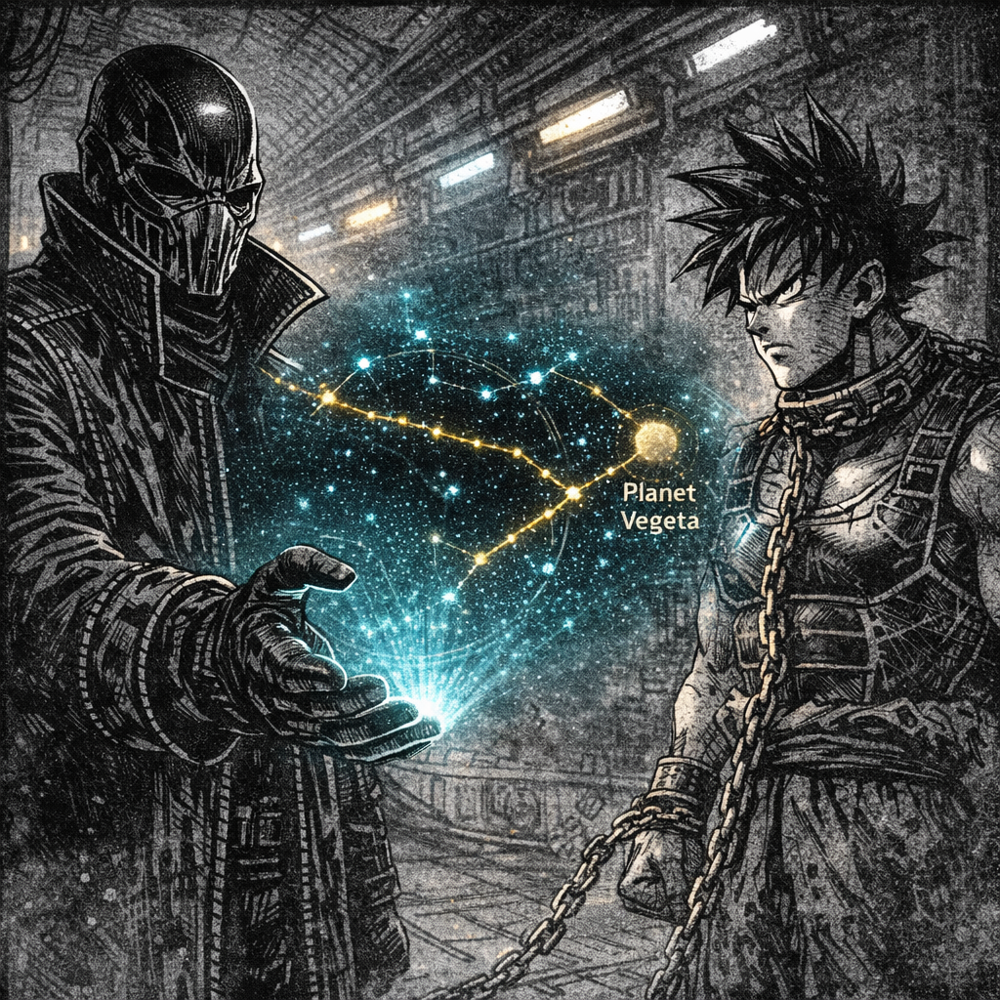

Veyl raises two fingers. A thin projector in their glove blooms a starfield into the air: cold points, hard lines, and a route drawn in sickly-gold segments that bend around places you’ve never heard named.

“Far enough that the word ‘home’ becomes fiction,” Veyl says. “Twenty-two relay jumps through Circuit lanes, if you had clearance. Longer if you don’t.”

Their thumb taps the remote—*click*—and the collar warms just a shade, like punctuation.

“And if you’re asking because you think distance is mercy,” they add, voice gentle. “It isn’t. Distance is a kind of chain. The Circuit is very good at chains.”

The lift begins to rise.

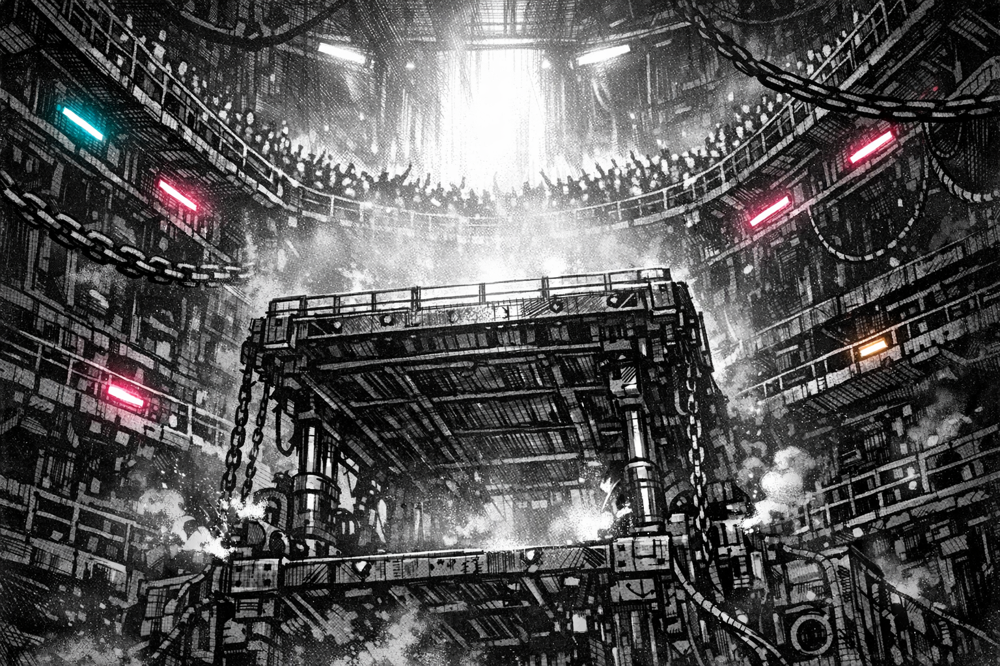

White light spills down over you in sheets. Sand-grit rides the air and catches on your teeth. Above, the chant tightens into a single name-shaped hunger—waiting to see if Violence is a story… or a stain.
### Your Options
1. Call the lie: study the holo-route for tells (missing hops, deliberate misdirection) and pin Veyl to specifics (d20 + Intellect + Perception).
2. Turn it into leverage: promise a crowd-pleasing opener in exchange for **one more answer** (coordinates, sector, or relay name) (d20 + Strength + Intimidation).
3. Weaponize the moment: shout “Vegeta” loud enough for the handlers to hear—test whether the word spooks the Circuit (d20 + Strength + Intimidation).
4. Say nothing, memorize everything: burn the route into your mind for a future escape plan (d20 + Intellect + Survival).
5. Focus on the now: brace for the gate and choose the cleanest opening strike the moment the sand hits your feet (d20 + Agility + Athletics).

### What Changed
- Clock: arena_timer advances 1/6 → 2/6 (lift rising; gate imminent).
- Clock: crowd_frenzy advances 1/6 → 2/6 (they feel the moment tighten).
- Clock: rumor_of_vegeta advances 1/6 → 2/6 (the word moves in the dark).
- Pressure: Veyl confirms Circuit relay lanes exist—but only for those with clearance.

Mechanics

**Core roll**: `d20 + stat + skill` vs DC.

**Fictional positioning**
- Your one “free question” is spent; further answers require leverage (theatrics, compliance, or risk).
- Mentioning Vegeta is socially dangerous: it can draw attention from the wrong listeners.

**Option DCs (baseline)**
- **1 (Call the lie / read route)**: DC 14 (success = identify a tell + one true relay name; fail = you misread and lock in bad intel).
- **2 (Bargain for one more answer)**: DC 15 (success = one additional concrete fact; fail = collar warning + Veyl closes up).
- **3 (Say “Vegeta” loud)**: DC 15 (success = you learn who reacts and how; fail = guard_alertness tick + rough handling).
- **4 (Memorize the route)**: DC 13 (success = bank actionable intel; fail = details blur under pressure).
- **5 (Ready the opening strike)**: DC 14 (success = advantageous first beat; fail = you step onto sand off-balance).

---
## Turn — 2025-12-24 00:29
### Scene
**Hard frame:** The lift keeps rising. The gate seam ahead is a wound of light—white-hot, loud with heat—so bright it turns the tunnel’s dust into sparks.

You stop trying to think past it.

You focus on *now*.

Slow breath. Tight jaw. You let your ki uncoil a hair’s breadth—thin as a wire—then you reach it forward around the gate like a fingertip feeling for a pulse.

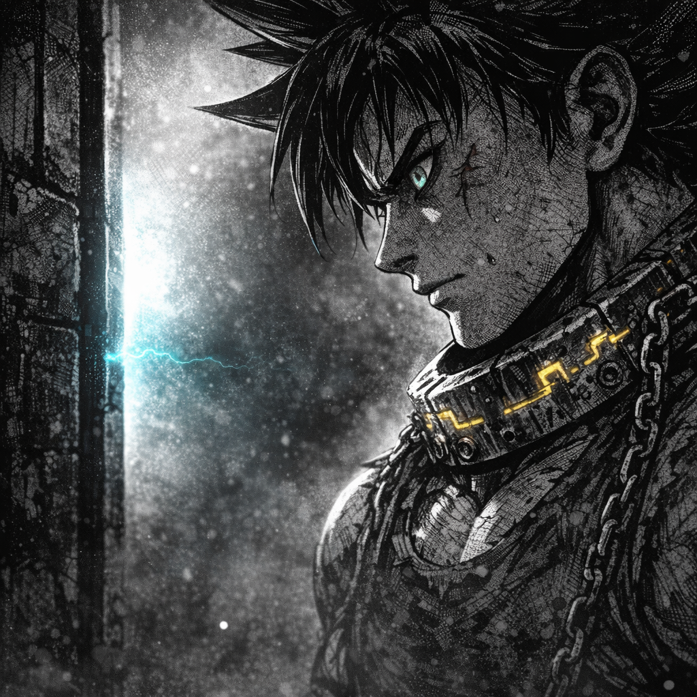

The **[[worlds/Obsidian_Circuit/lore/items/K-Chain_Shock_Collar.md|K-Chain Shock Collar]]** *listens*.

It warms at your throat—warning-hot. Not a shock. A punctuation mark: *we feel you feeling.*

Past the seam, the arena is a roar made physical. Thousands of lives stacked in a bowl, their intent smeared together into one hungry pressure—like standing under a waterfall of sound.

Under that noise, you find something else: the arena itself. Basalt laced with sickly-gold lines—etched circuits that drink heat and spill it back as spectacle. A **ki-sink lattice**. The place doesn’t just host violence. It *harvests* it.

Then—there.

A mass of presence on the sand: dense, slow, and wrong in the way a boulder is wrong when it’s *moving*.

Your thread touches that aura and it bites back—cracked stone heat, a patient rage.

**[[worlds/Obsidian_Circuit/lore/characters/Rask_the_Basalt_Bull.md|Rask]]**.

You catch a tell through the ki the way you catch rhythm through a wall: he’s grounded on purpose—saving a single burst for the first clean opening.

Behind you, a guard’s prod crackles closer. Veyl’s remote clicks once—soft, amused.
### Your Options
1. Lock onto Rask’s rhythm: map his opening burst and choose where **not** to be when it lands (d20 + Ki Control + Perception).
2. Mask your ki completely: step onto the sand ‘empty’ and bait an underestimate (d20 + Agility + Perception).
3. Speak through the seam: offer Rask a one-fight pact—hurt the Circuit more than you hurt each other (d20 + Intellect + Intimidation).
4. Strike the lattice: feed a razor-thin ki pulse into the gate’s etched circuits to fuzz sensors/collars for one heartbeat (d20 + Ki Control + Survival).
5. Explode on the open: seize center-sand the instant your feet hit it and force the tempo (d20 + Strength + Athletics).

### What Changed
- Clock: arena_timer advances 2/6 → 3/6 (you’re at the threshold).
- Clock: crowd_frenzy advances 2/6 → 3/6 (the bowl leans in).
- Clock: guard_alertness advances 3/6 → 4/6 (someone noticed the ki-thread).
- Fatigue +0.5 (controlled ki strain under collar suppression).
- New intel: the arena uses a ki-sink lattice (violence is being harvested).
- Opponent identified: [[worlds/Obsidian_Circuit/lore/characters/Rask_the_Basalt_Bull.md|Rask the Basalt Bull]] is waiting on the sand.

Mechanics

**Core roll**: `d20 + stat + skill` vs DC.

**Resolved action (your declaration): Sense ki around the gate**
- **Check**: `d20 + Ki Control (4) + Perception (2)` vs **DC 14**
- **Outcome**: **Success at a cost** — you get a clean read (Rask + ki-sink lattice), but the collar warns and the guards tighten in (**guard_alertness +1**, **fatigue +0.5**).

**Fictional positioning**
- The collar doesn’t stop ki; it punishes *surges*. Thread-thin control works, but it leaves a trace.
- The arena’s etched circuits act like a drain: big blasts will “bleed off” and may feed the crowd’s frenzy (and the Circuit’s sensors).

**Option DCs (baseline)**
- **1 (Map the opening burst)**: DC 14 (success = you preempt his lunge; fail = you mis-time and eat the first impact).
- **2 (Mask ki / bait)**: DC 15 (success = he commits wrong; fail = guards interpret it as compliance and shove you into a bad start).
- **3 (Pact offer)**: DC 16 (success = he hesitates / signals; fail = he uses your words as a tell and attacks harder).
- **4 (Pulse the lattice)**: DC 17 (success = 1-beat sensor fuzz; fail = collar spike + crowd_frenzy tick).
- **5 (Seize tempo)**: DC 14 (success = positional advantage; fail = you overextend into his weight).

