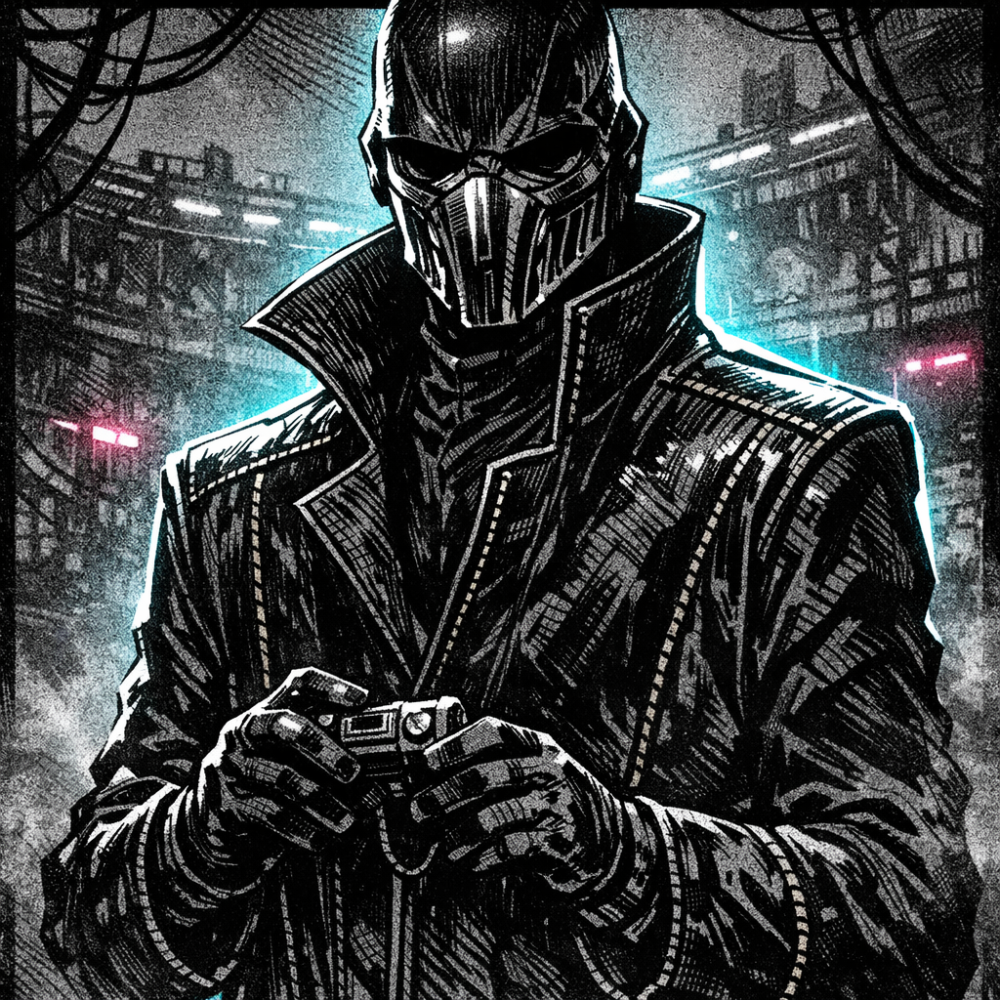

# Pitmaster Veyl

## Summary
The Circuit’s under-arena authority: smooth voice, precise cruelty, and a ledger for every bruise you’ve ever earned them.

## Physical Description
Tall, narrow build; lacquer-black coat with gold seam-stitching; face half-hidden by a mirrored respirator plate; gloved hands always clean, always close to the collar remote.

## Personality
- Polite when you’re useful
- Curious about breaking points
- Never wastes a threat twice

## Goal
Turn you into a profitable spectacle without letting you become a symbol.

## Leverage
Collar frequency control, ration allotments, fight assignments.

## Fear / Desire
- **Fear**: an “unowned” Saiyan on the loose
- **Desire**: a champion who believes the Circuit is their only home

## Current Status
On the arena rail during a post-fight intervention, directing extraction with the collar remote and guards.

## Visual Canon
- **Reference Images**: `lore/characters/Pitmaster_Veyl_portrait.png`
- **Notes**: Mirrored respirator plate, lacquer-black coat with sickly-gold stitching, immaculate gloves and collar-remote.

## Meta
**Tags**: #character #npc #arena

## Appears In
- [[worlds/Obsidian_Circuit/campaigns/Saiyan_Pits/campaign_logs/000_Setup.md|000: Setup]]
