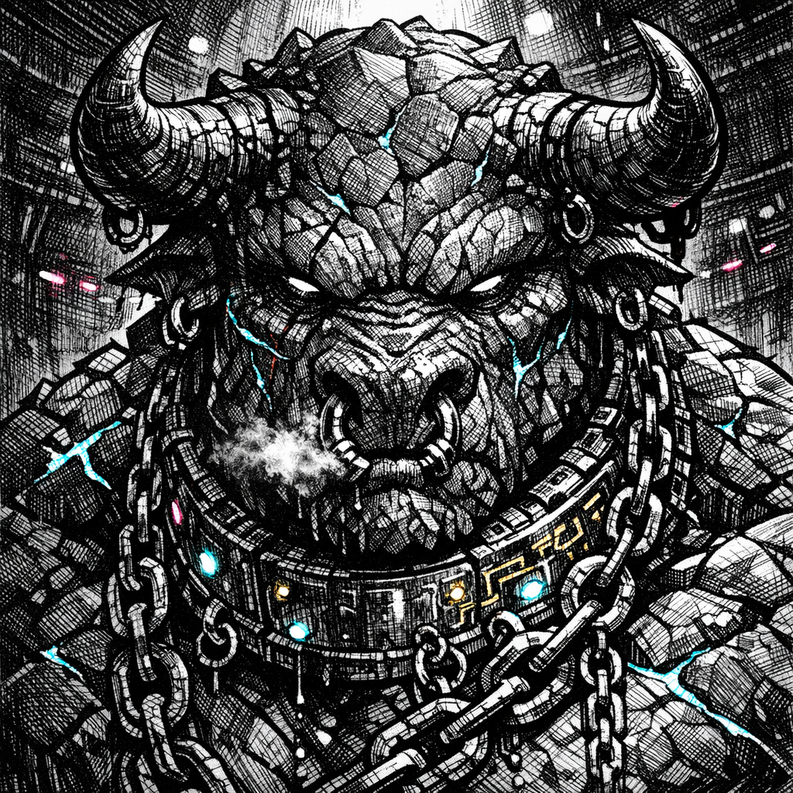

# Rask the Basalt Bull

## Summary
A pit-bred wrecking engine: slow until he isn’t, and heavy enough that the sand remembers his footsteps.

## Physical Description
Massive, horned build; basalt-like stone plates for skin with hairline fissures that glow faint cyan under arena light; scarred muzzle; chain piercings; a pitted chrome K‑Chain collar etched in sickly-gold circuits.

## Personality
- Quiet, predatory patience
- Conserves motion; spends violence all at once
- Treats deals like traps (even when they’re real)

## Goal
Survive long enough to earn a “name” the Circuit can’t take back.

## Leverage
Body mass, pain tolerance, and the crowd’s love for simple outcomes.

## Fear / Desire
- **Fear**: becoming entertainment without becoming *danger*
- **Desire**: one clean victory the Circuit can’t edit

## Current Status
Killed on the sand during a handler intervention; body still in the arena as guards move to restrain the victor.

## Visual Canon
- **Reference Images**: `lore/characters/Rask_the_Basalt_Bull_portrait.png`
- **Notes**: Basalt plates with subtle cyan fissure-glow, small forward-curving horns, heavy shadowed brow, K‑Chain collar hardware.

## Meta
**Tags**: #character #npc #arena #gladiator

## Appears In
- [[worlds/Obsidian_Circuit/campaigns/Saiyan_Pits/campaign_logs/000_Setup.md|000 Setup]]
