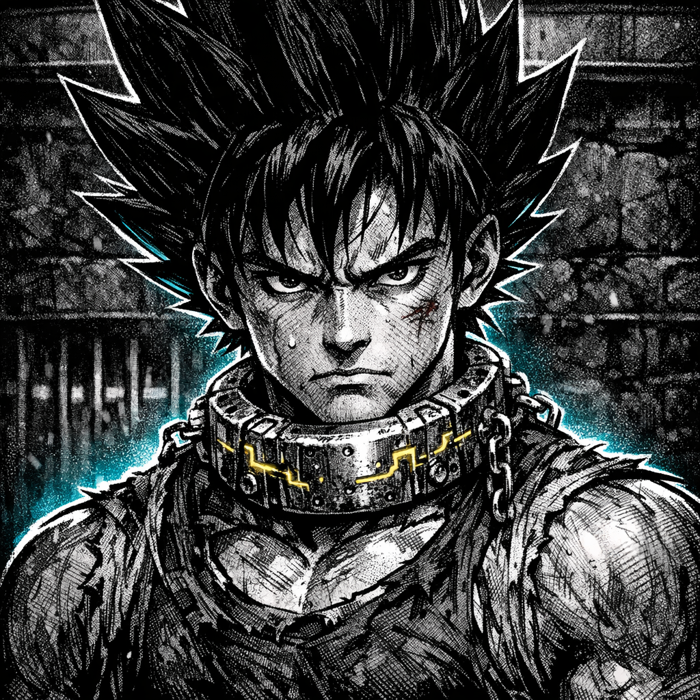

# Unnamed Saiyan

## Summary
A Saiyan captive in the [[worlds/Obsidian_Circuit/lore/locations/Obsidian_Pits.md|Obsidian Pits]]—one year hardened by sand, shock, and spectacle. The Circuit records you as an “asset,” but you’ve started to answer with something sharper.

## Physical Description
Muscular, compact power with old bruises and thin scar-lines; sweat-stiff pit wraps and improvised bindings; a pitted chrome **[[worlds/Obsidian_Circuit/lore/items/K-Chain_Shock_Collar.md|K-Chain Shock Collar]]** seated heavy at the throat with sickly-gold circuit etching. Thick, gravity-defying Saiyan hair silhouette (shape to be defined as you claim a name). Eyes alert, predatory—always watching the next hand on the remote.

## Personality
- Stubborn survival instinct; hates being “managed”
- Conserves emotion like rations, spends violence all at once
- Learns systems fast (collars, guards, gates) and looks for seams

## Goal
Earn a name the Circuit can’t rewrite—and a way out that doesn’t require begging.

## Leverage
Saiyan endurance, crowd psychology, and a growing understanding of the collar’s limits.

## Fear / Desire
- **Fear**: dying as background noise in someone else’s highlight reel
- **Desire**: a clean moment of self-ownership (even if it costs blood)

## Current Status
In the under-arena holding cells as the next gate cycle approaches; Pitmaster Veyl is personally present.

## Visual Canon
- **Reference Images**: `lore/characters/Unnamed_Saiyan_portrait.png`
- **Notes**: Collar hardware is pitted chrome with sickly-gold circuit etch; wraps are ragged and sweat-stiff; scars are subtle but readable; high-contrast rim light with dust/ozone haze.

## Meta
**Tags**: #character #player #saiyan #arena #gladiator

## Appears In
- [[worlds/Obsidian_Circuit/campaigns/Saiyan_Pits/campaign_logs/000_Setup.md|000: Setup]]

