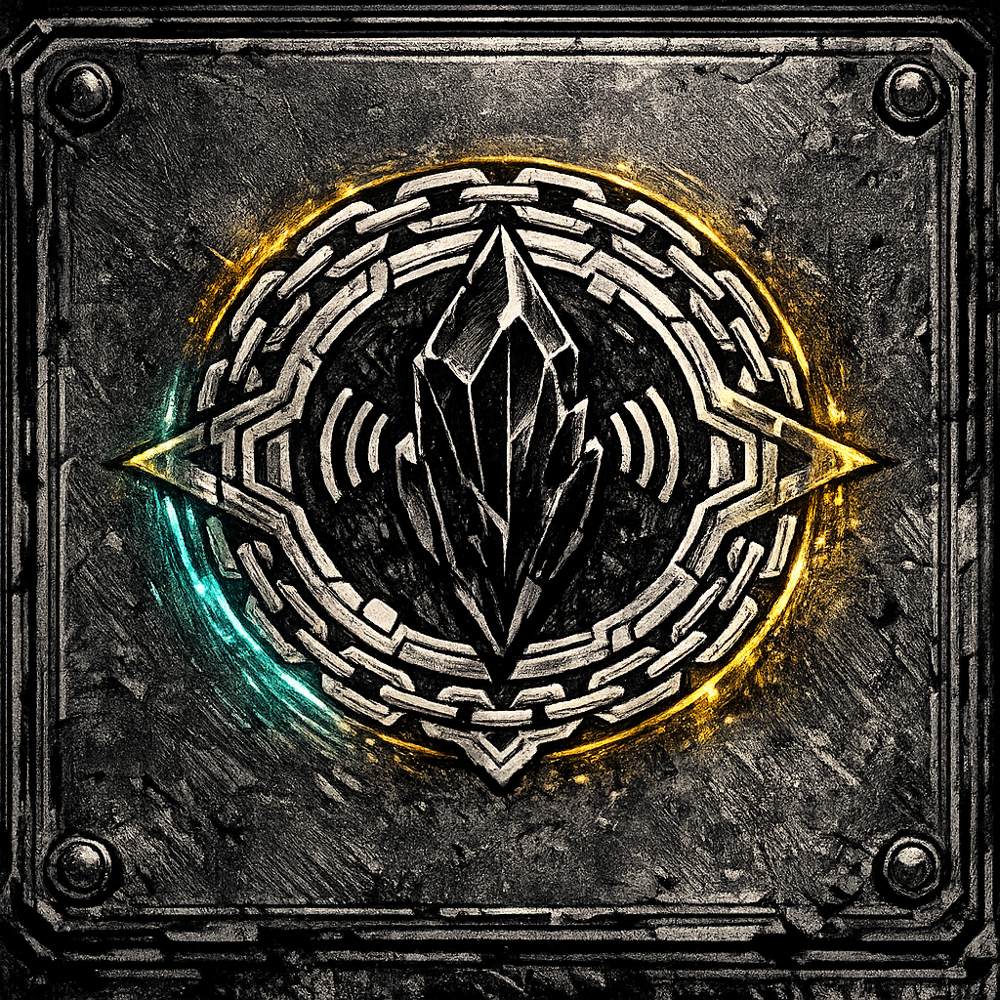

# Obsidian Circuit

## Summary
An intergalactic gladiatorial civilization that profits from captured fighters, engineered rivalries, and broadcast carnage.

## Goal
Convert violence into stable revenue: keep fights dramatic, outcomes controllable, and assets replaceable.

## Leverage
- Shock collars, ration control, match-fixing contracts
- Crowd influence (chants become policy)
- Debt: buy freedom, then owe the Circuit forever

## Fear / Desire
- **Fear**: a unified revolt across the pits
- **Desire**: a “legend” champion they can brand and sell

## Current Status
The Circuit’s season is peaking; matchmakers are escalating stakes and tightening collars.

## Visual Canon
- **Reference Images**: `lore/factions/Obsidian_Circuit_sigil.png`
- **Notes**: Angular circuit-ring motif, obsidian shard core, chain-link geometry, sickly-gold and neon-cyan accents.

## Meta
**Tags**: #faction #arena #slavers

## Appears In
- [[../../campaigns/Saiyan_Pits/campaign_logs/000_Setup.md|000: Setup]]
