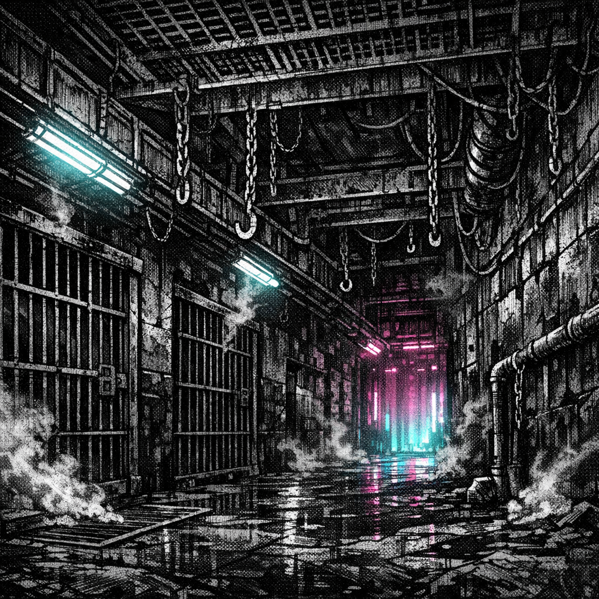

# Obsidian Pits

## Summary
The under-arena holding labyrinth: basalt corridors, iron cages, and a constant haze of ozone from collars and stun prods.

## Sensory Description
Cold stone sweats in sheets; metal tastes like old blood. Every sound carries—chain rattle, distant crowd roar, the bell’s hollow thump traveling through your teeth.

## Visual Canon
- **Reference Images**: `lore/locations/Obsidian_Pits_establishing.png`
- **Notes**: Black basalt walls, iron cages, catwalk grates, harsh fluorescents, steam vents, ozone haze.

## Meta
**Tags**: #location #arena #captivity

## Appears In
- [[../../campaigns/Saiyan_Pits/campaign_logs/000_Setup.md|000: Setup]]
