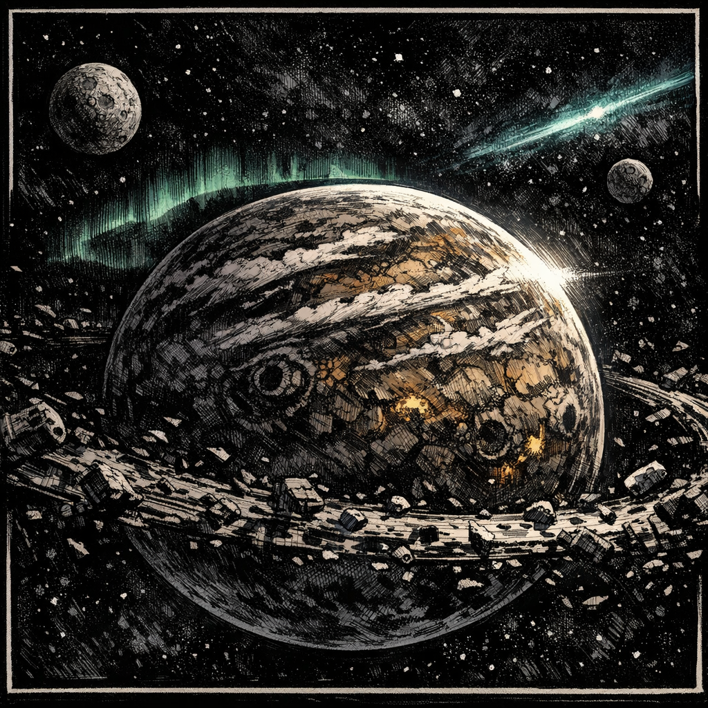

# Planet Vegeta

## Summary
The Saiyan homeworld—distant, militarized, and myth-heavy even when you can still point at it on a star chart.

## Sensory Description
In memory it smells like scorched rock after rain that never comes; it sounds like training yards at dawn—boots, shouted counts, and the crack of impact on bone. The sky feels too big and too loud, as if the planet itself is always daring you to swing first.

## Visual Canon
- **Reference Images**: `lore/locations/Planet_Vegeta_establishing.png`
- **Notes**: Rugged ochre/iron world tones, hard sunlight, storm bands, faint aurora; the “weight” of a martial home.

## Meta
**Tags**: #location #saiyan #homeworld

## Appears In
- [[../../campaigns/Saiyan_Pits/campaign_logs/000_Setup.md|000: Setup]]

