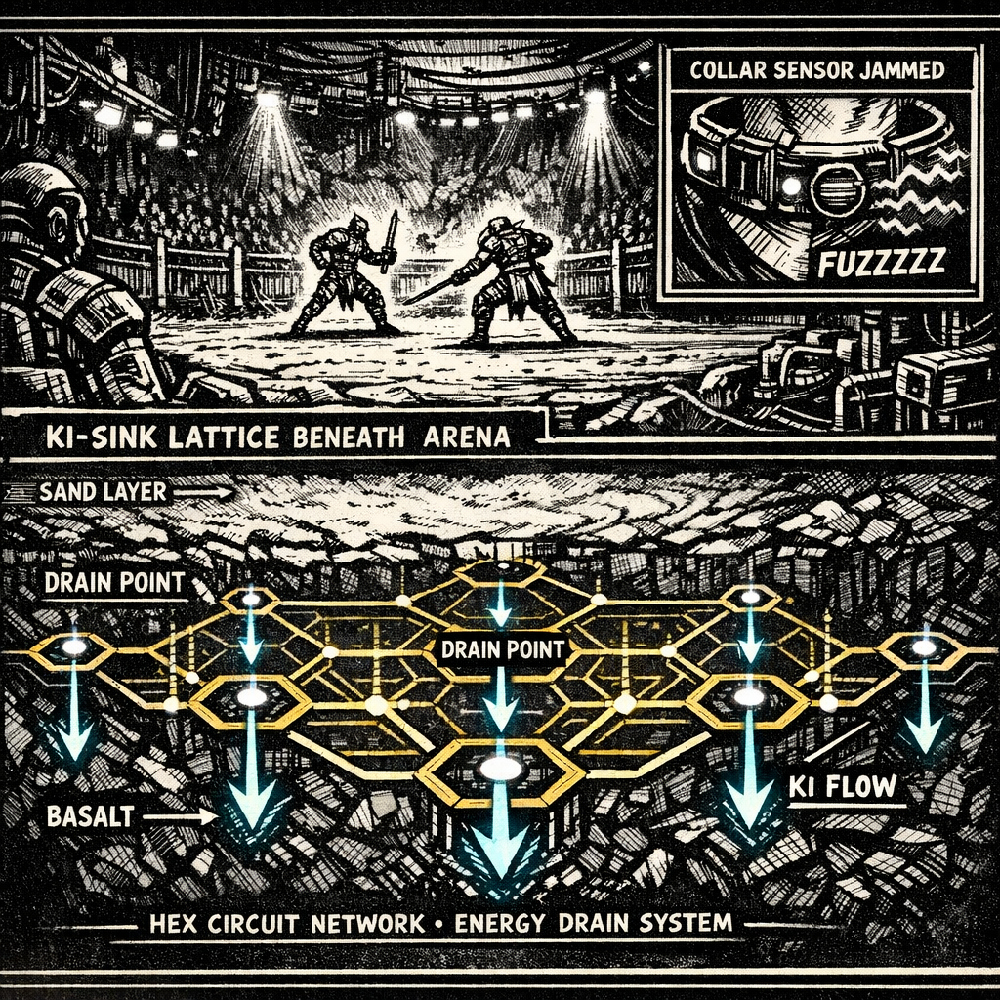

# Ki-sink Lattice

## Summary
Etched circuitry embedded in arena basalt that **drains high-output ki surges** into the Circuit’s infrastructure—dulling big blasts, amplifying spectacle, and leaving fighters “heard” when they push too hard.

## Description
Under the sand is not stone—it’s a **pattern**. Sickly-gold grooves in basalt like veins, faint cyan heat in the cuts when the lights hit them. When ki spikes, the lattice answers with a hungry pull, as if the floor is breathing in through your soles.

## How It Shows Up In Play
- **Big output bleeds off**: flashy surges lose edge and may feed the crowd’s frenzy.
- **Thin control slips through**: thread-ki can navigate the lattice without tripping it… but leaves traceable “pressure ripples”.
- **The Circuit listens**: the lattice is part arena, part sensor grid.

## Counters / Exploits
- Grounding and movement discipline reduces “spill.”
- Short, timed pulses can fuzz readings for a heartbeat (high risk).
- Dust/sand displacement can reveal line direction and node clusters.

## Meta
**Tags**: #technique #hazard #arena #ki

## Appears In
- [[../../campaigns/Saiyan_Pits/campaign_logs/000_Setup.md|000: Setup]]

