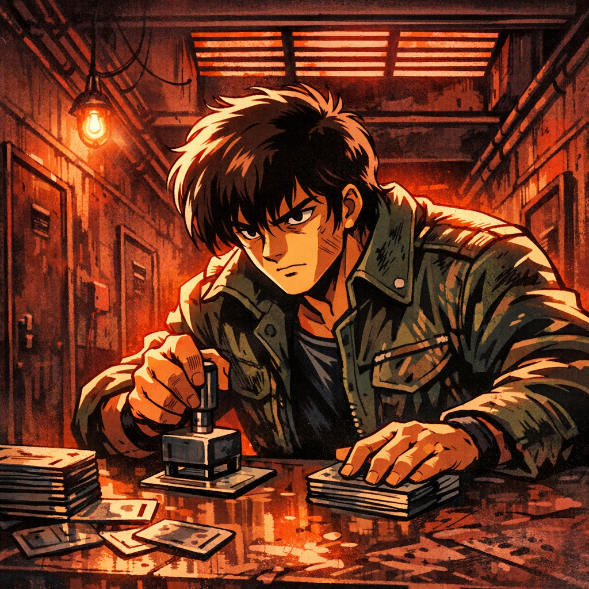

# 000 — Setup

You are a low-class Saiyan on [[worlds/Planet_Vegeta/lore/locations/Planet_Vegeta.md|Planet Vegeta]], one year before [[worlds/Planet_Vegeta/lore/characters/Freeza.md|Freeza]] destroys it.

**Now Playing**
- **Location**: [[worlds/Planet_Vegeta/lore/locations/Low_Class_Barracks.md|Low-Class Barracks]] (Vegeta City)
- **HP**: 28
- **Fatigue**: 2
- **Hunger**: 1
- **XP**: 0

## Canon Questions (Answer In-Character Or OOC)
- What’s your real name? (or what do people call you)
- Tail status: present (wrapped/bound) vs removed?
- What’s your signature tell when you’re about to explode into action?

---
## Turn — 2025-12-24 17:20
### Scene
**Hard frame:** Late afternoon outside the agenda wall—the whistle, the slate, the crowd waiting for the lottery code, and every scouter-lit eye tuned to the same line.

You cut through the corridor crush and make a beeline for the slate again—like it might blink and rewrite your future while you’re looking away.

There’s a small knot of low-class around it now, pretending they’re just “checking muster time” while their eyes keep dipping to the same line:

**DEPLOYMENT LOTTERY (late): squad postings announced; offworld prep begins.**

Behind the slate—half-hidden by bodies—you spot the real mechanism: a runner in a garrison jacket, stamping thin metal chits one by one. Each chit has a destination code, a time window, and a squad slot. They drop into a lockbox with the soft, final sound of decisions.

You push in close enough that the runner has to acknowledge you. Close enough to let your voice land where it hurts.

“Offworld,” you say. Not a question.

The runner’s eyes flick to your armor, your stance, the way you’re not asking permission. You watch his hands. He hesitates—then shifts his thumb on the stamp, and you catch the edge of a code before he hides it again.

“You want out,” he murmurs, like it’s a sickness. “Fine. There are *gigs*. But the garrison’s hungry today. Quotas. Anyone ‘interesting’ gets… *sorted*.”

He leans in just enough that his breath hits your cheek.

“Listen. Lottery’s at **nineteen-hundred** in the yard. You want an offworld slot, you don’t stand in the center like a proud idiot. You get your name where it needs to be *before* the stamp hits.”

Then he straightens, loud again—public voice, public truth—like you never spoke at all.

You’ve got a window. And the barracks is already moving like a machine that just found a new gear.

### Your Options
1. Quiet leverage: catch the runner alone and trade something small (labor, silence, a favor) for a specific destination code (d20 + Intellect + Survival).
2. Loud leverage: stage a “helpful” correction in front of witnesses so the runner *has* to treat you carefully (d20 + Intellect + Intimidation).
3. Info first: read the garrison flow—who’s angling offworld, who’s avoiding it, and which officers are watching the slate (d20 + Intellect + Perception).
4. Counterplay: sabotage a rival’s paperwork so they get stuck planetside (and they’ll know it was you) (d20 + Intellect + Survival).
5. Walk away on purpose: stay average, attend muster, and let the lottery fall where it falls (no roll; but clocks advance).

### What Changed
- New intel: deployment lottery occurs at 19:00 today (yard).
- Clock: `royal_muster_pressure` advances 2/6 → 3/6 (the machine speeds up).
- Clock: `market_tension` advances 1/6 → 2/6 (offworld scramble spreading).
- New clock: `deployment_lottery` starts at 1/4 (time window opened).

Mechanics

**Resolved action (real roll):** Angle for offworld deployment.
- **Roll**: `d20 + Intellect (3) + Intimidation (1)` → **14** vs **DC 14** → **Success**
- **Outcome:** You identify the runner + the real timing (19:00) and gain a small window to influence your posting before the public draw.

**Core roll** (if you choose an option): `d20 + stat + skill` vs DC.

**Option DCs (baseline)**
- **1 (Quiet leverage)**: DC 13 (success = you secure a specific chit; fail = you owe someone).
- **2 (Loud leverage)**: DC 14 (success = runner handles you carefully; fail = officer attention).
- **3 (Read the flow)**: DC 12 (success = identify rivals + watchers; fail = you’re marked as “too curious”).
- **4 (Sabotage)**: DC 15 (success = rival gets stuck; fail = you’re caught or traced).
- **5 (Walk away)**: No roll (you keep your hands clean, but lose agency).

**World clocks (current)**
- `frieza_inspection`: 1/6
- `royal_muster_pressure`: 3/6
- `scouter_quota`: 2/6
- `market_tension`: 2/6
- `deployment_lottery`: 1/4

---
## Turn — 2025-12-24 17:06
### Scene
You don’t even need to ask twice.

Someone—trying to sound important—answers your question by *pointing* with their chin toward the corridor.

Outside the bunk rows, the barracks has a “public truth” wall: a metal slate bolted to concrete, updated with grease pencil and stamped seals. It’s where your day gets decided for you.

The slate is simple. Brutal. Efficient.

**TODAY’S AGENDA (Vegeta City — Low-Class Blocks)**
- **MUSTER** (immediate): scouter-on verification, attendance marks.
- **SCOUTER CALIBRATION** (after muster): readouts logged; “outliers” flagged for follow-up.
- **YARD DRILLS** (midday): endurance runs + spar rotations (injuries are “your fault”).
- **DEPLOYMENT LOTTERY** (late): squad postings announced; offworld prep begins.
- **CURFEW CHECKS** (night): armor inspected; doors locked; “discipline” patrols.

At the bottom, under an official stamp you don’t recognize, someone has added a second line in smaller writing:

**“NO EXCUSES. QUOTAS WILL BE MET.”**

You feel the room read it with you—like a shared bruise. People don’t talk about it out loud, but everyone understands the shape of the day now:

If you’re average, you’re ignored.

If you’re weak, you’re corrected.

If you’re *interesting*, you’re collected.

### Your Options
1. Blend in on purpose: hit muster early, keep your ki quiet, and aim for “average” on the logs (d20 + Intellect + Perception).
2. Game the calibration: subtly spike a scouter reading on someone else to redirect attention (d20 + Intellect + Survival).
3. Use drills to your advantage: pick your spar partner and turn the yard into a private test (d20 + Strength + Brawling).
4. Chase the posting: angle for (or away from) offworld deployment by leaning on a small favor or threat (d20 + Intellect + Intimidation).
5. Information first: tail the runner who wrote “quotas” and find who ordered it (d20 + Agility + Perception).

### What Changed
- Clock: `scouter_quota` advances 1/6 → 2/6 (calibration day posted).
- New intel: deployment lottery is scheduled for today.

Mechanics

**No-roll resolution:** Your question is answered by a posted agenda slate (public info).

**Core roll** (if you choose an option): `d20 + stat + skill` vs DC.

**Option DCs (baseline)**
- **1 (Blend)**: DC 12 (success = you stay off any list).
- **2 (Redirect attention)**: DC 15 (success = heat moves; fail = you’re noticed).
- **3 (Spar test)**: DC 13 (success = learn a rival’s tells; fail = injury/rivalry).
- **4 (Posting angle)**: DC 14 (success = influence the lottery; fail = retaliation).
- **5 (Tail the runner)**: DC 14 (success = identify the order chain; fail = you’re tailed back).

---
## Turn — 2025-12-24 15:38
### Scene
**Hard frame:** Morning in the [[worlds/Planet_Vegeta/lore/locations/Vegeta_City.md|Vegeta City]] low-class blocks: grit in the air, a red sky smeared with engine smoke, and the barracks walls sweating cold metal.

Inside the [[worlds/Planet_Vegeta/lore/locations/Low_Class_Barracks.md|Low-Class Barracks]], bodies shift on stacked bunks. Armor plates clack softly as people sit up—half-asleep, already irritated. A scouter somewhere chirps an error tone until someone slaps it quiet.

You swing your legs down. The floor is cold through your soles. Your armor is where you left it—white plating scratched into dull gray, straps re-threaded and re-threaded. Your tail (if you still have it) is wrapped tight at your waist; the knot digs when you breathe too deep.

From the corridor: boots—fast, purposeful—then the bark of an order that doesn’t bother pretending it’s optional.

“**Muster.** Five minutes. Scouters on. Anyone late runs until they cough blood.”

It’s not the words that make the room tighten—it’s the *tempo*. This is the third “five minute” muster this week. Something is pushing the [[worlds/Planet_Vegeta/lore/factions/Saiyan_Military.md|garrison]] to move faster, to measure harder, to separate the “useful” from the “replaceable.”

For a moment, between the boots and the scouter chirps, you catch another sound through the building’s thin bones: engines spooling on a distant pad… and a crowd’s low murmur like weather rolling in.

Your day is starting whether you’re ready or not.

### Your Options
1. Show up early and watch the officers’ hands and scouter readouts for the real reason behind the tempo (d20 + Intellect + Perception).
2. Skip the corridor crush—get to the roofline and move across the blocks to arrive from above (d20 + Agility + Athletics).
3. Use the “five minutes” to eat, hydrate, and reset your breathing before anyone can see weakness (d20 + Survival + Intellect).
4. Provoke a spar in the yard to “warm up” and read who’s suddenly hungry to prove themselves (d20 + Strength + Brawling).
5. Lay low and listen: eavesdrop on the runners and comms for the word nobody wants to say out loud (Freeza) (d20 + Intellect + Perception).

### What Changed
- Location locked in: Vegeta City — Low-Class Barracks.
- New pressure: muster tempo increasing (`royal_muster_pressure` currently 2/6).

Mechanics

**Core roll**: `d20 + stat + skill` vs DC.

**Option DCs (baseline)**
- **1 (Early + observe)**: DC 13 (success = you learn what’s driving the musters).
- **2 (Roofline route)**: DC 14 (success = arrive clean; fail = attention + fatigue).
- **3 (Fuel up)**: DC 12 (success = reduce fatigue next turn by 1; fail = you lose time).
- **4 (Yard spar)**: DC 13 (success = learn who’s sharpening for trouble; fail = minor injury or rivalry).
- **5 (Eavesdrop)**: DC 15 (success = a real lead; fail = rumor noise + suspicion).

**World clocks (current)**
- `frieza_inspection`: 1/6
- `royal_muster_pressure`: 2/6
- `scouter_quota`: 1/6
- `market_tension`: 1/6

