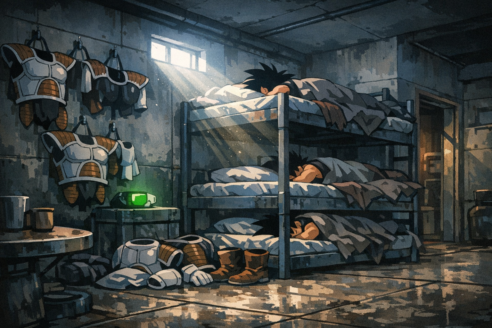

# Low-Class Barracks (Vegeta City)

A concrete-and-metal hive for the low-class: bunks stacked tight, armor hung like shedding skin, the air always tasting of sweat and dust.

**Tags**: #location #low_class #barracks

## Sensory Notes
Cold metal under your shoulder blades. Scouter chirps bouncing off bare walls. The sour edge of recycled air fighting the smell of bodies and oil.

## Appears In
- [[worlds/Planet_Vegeta/campaigns/Last_Year/campaign_logs/000_Setup.md|000 Setup]]

