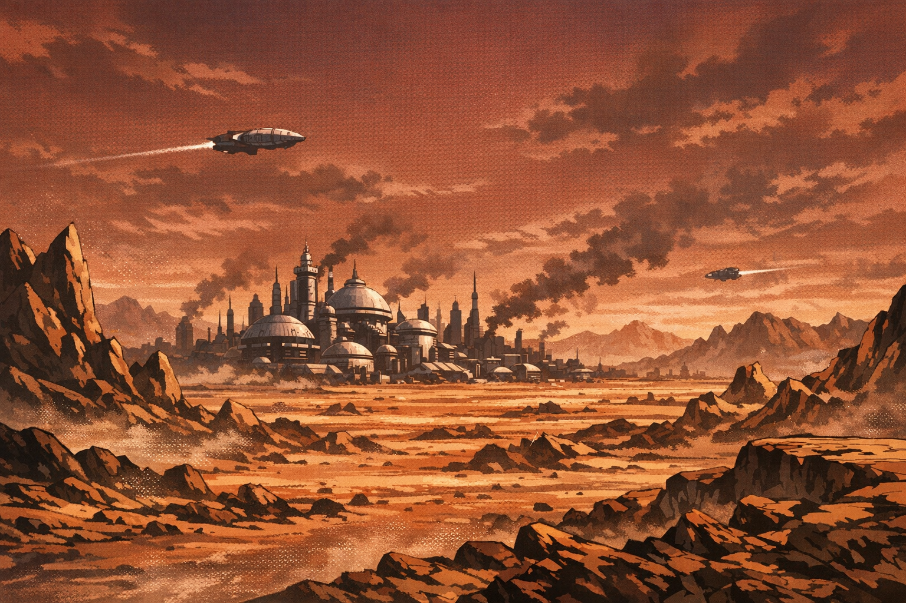

# Planet Vegeta

A hard, windy world under a red-brown sky—built for war, not comfort.

**Tags**: #location #planet_vegeta

## Sensory Notes
Metallic dust on the tongue. Thin warmth from the ground that never becomes heat. Engines everywhere—always one more ship taking off, always one more landing.

## Details
- **Gravity**: heavy enough to make offworlders sweat.
- **Culture**: strength is currency; mercy is a rumor.

## Appears In
- [[worlds/Planet_Vegeta/campaigns/Last_Year/campaign_logs/000_Setup.md|000 Setup]]

