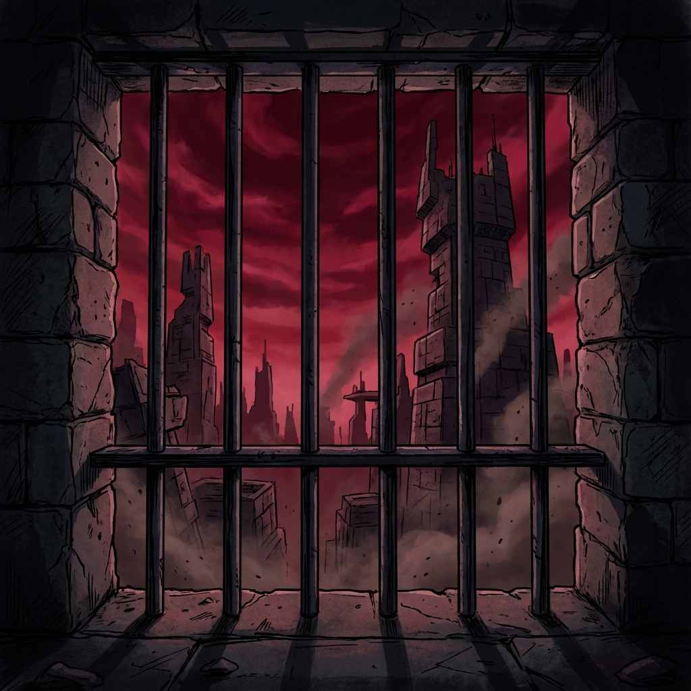
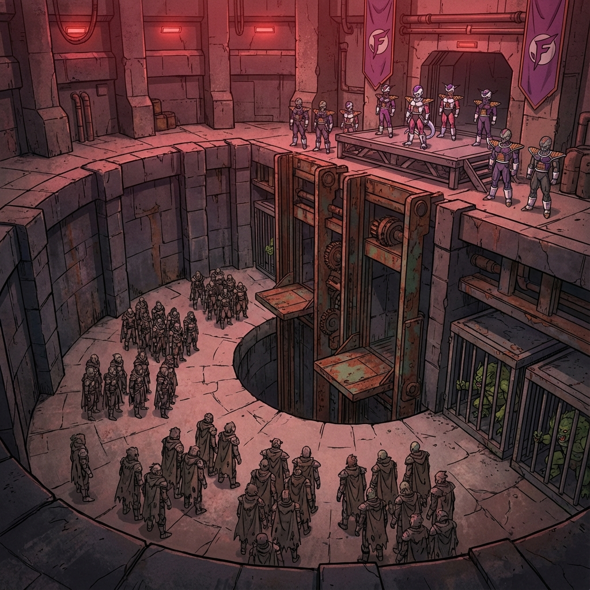
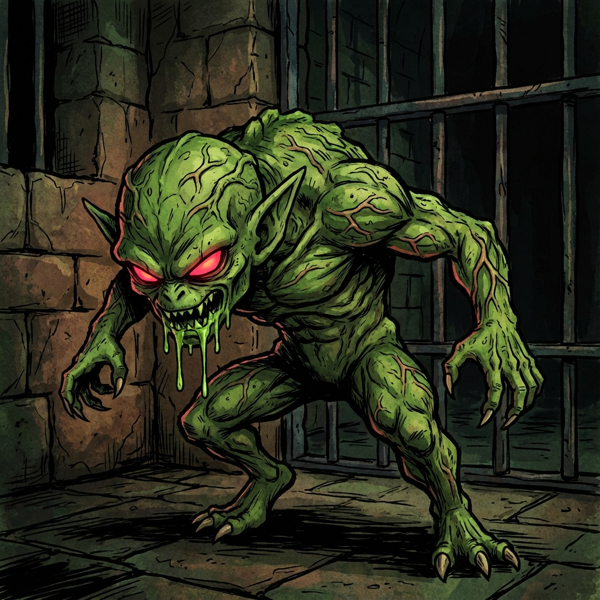
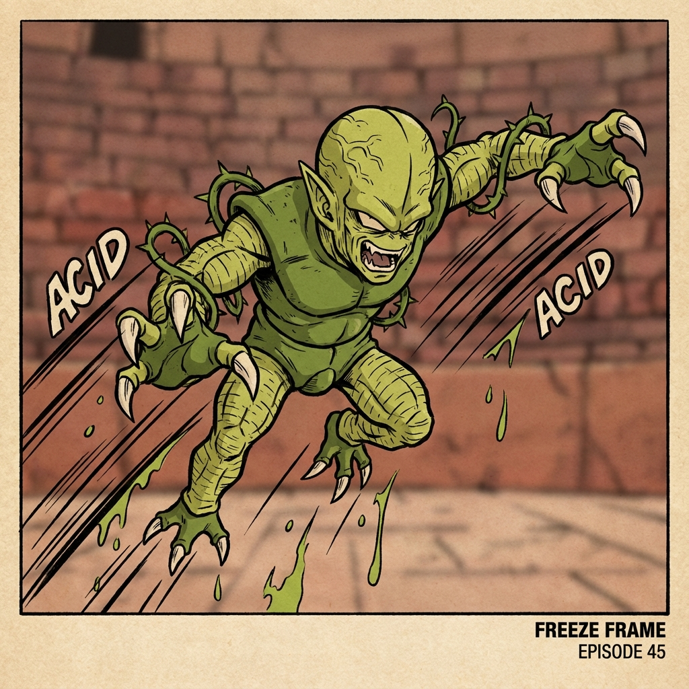
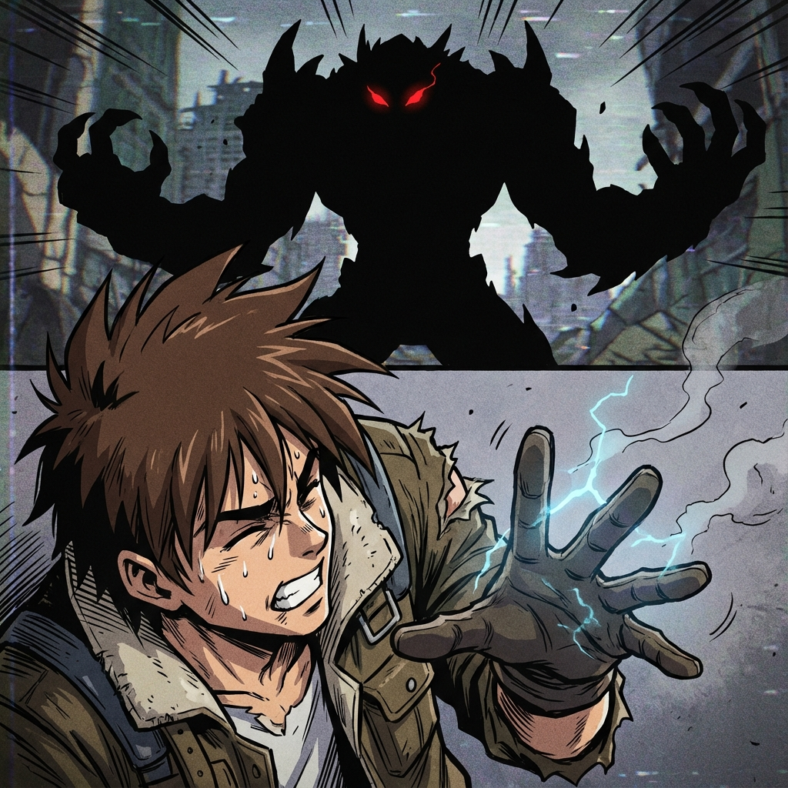
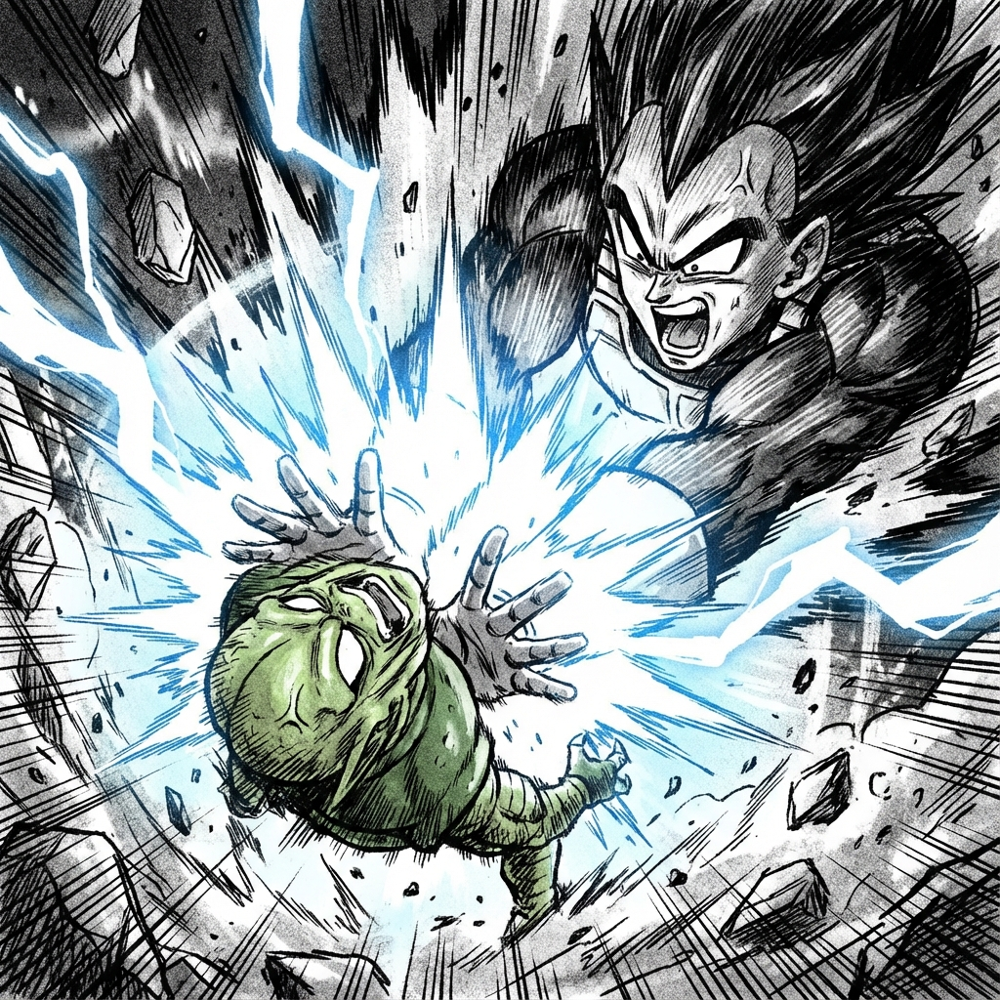
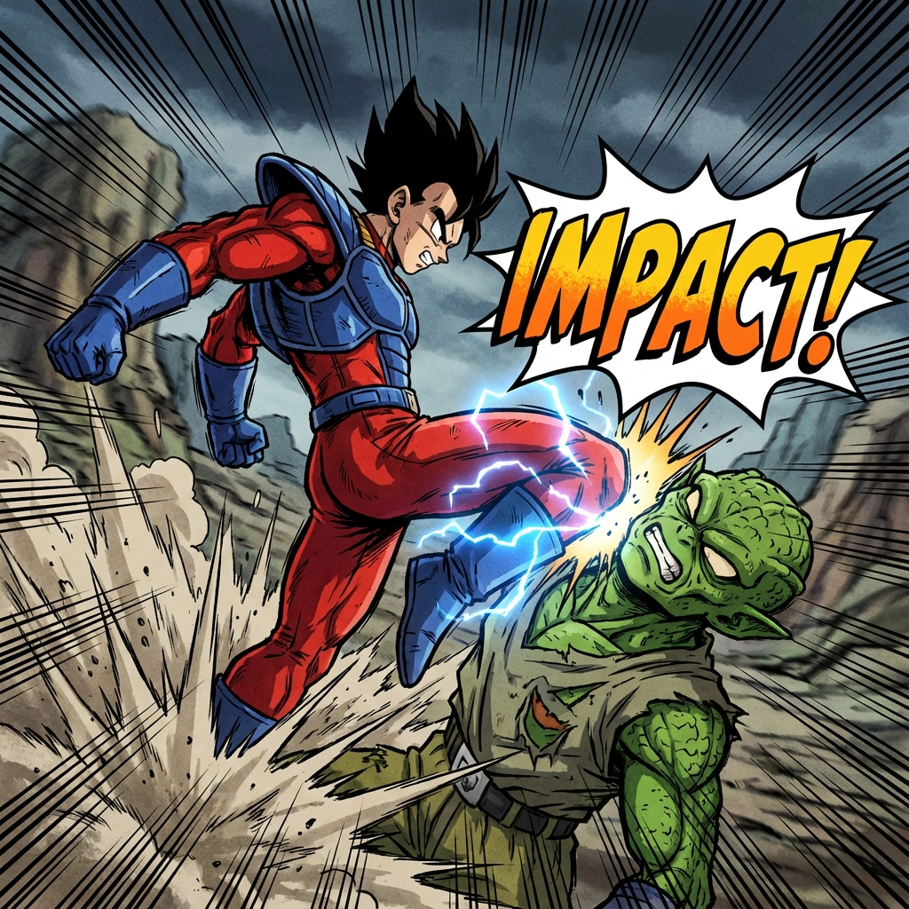

# 001_Slave_Pens

## Date: 1 Year B.D. (Before Destruction)
## Location: Imperial Arena Slave Pens, Sector 4

The red light of Planet Vegeta's suns bleeds through the barred window, painting the stone floor in shades of dried blood. Your stomach growls—a low, primal rumble that echoes in the small, damp cell. The gravity here feels heavier than usual today, or perhaps that's just the exhaustion of yesterday's 'training.'

You are **Cress**, a Slave Class Saiyan. Your power level is a pathetic 5. To the elites in the spires above, you are less than dirt. You are fodder.

The heavy iron door groans. **[Warden Nappa](../codex/characters/Warden_Nappa.md)**—not the elite general, but a cruel, distant relative with the same bald head and twice the sadism—stalks down the corridor. His scouter beeps rhythmically.

"Wake up, filth!" he bellows, dragging a metal baton across the bars. "The prelims start in one hour. If you don't fight today, you don't eat."

He stops in front of your cell. "You. Runt. You're up against a Saibaman sprout today. Try not to die in the first ten seconds; I have a bet on you lasting twelve."

He tosses a meager nutrient bar through the bars. It lands in the dust near your shackled feet.

**Immediate Stats:**
- **Health**: 100/100
- **Hunger**: 50/100 (Starving)
- **Fatigue**: 20/100

**Options:**
- Eat the nutrient bar immediately (Safety).
- Hide the food for later and train in the remaining hour (Risk: Hunger, Gain: XP).
- Inspect your shackles (Skill: Intellect).
- Talk back to Nappa (Risk: Combat/Punishment).

***

You snatch the nutrient bar from the dust, tearing off the wrapper with your teeth. It tastes like compressed chalk and stale oil, but your body accepts it greedily. The gnawing ache in your stomach subsides just enough to let you think.

Swallowing the dry mouthful, you look up at the towering figure. "Advice?" you ask, your voice raspy. "Any advice for the ring?"

**Skill Check: Charisma (10) vs DC 60**
> **Result**: Critical Failure (Margin -29)

The silence that follows is heavier than the gravity. Nappa blinks, his piggish eyes widening. Then, a low, wet rumble starts in his chest. He laughs—a hacking, wheezing sound that shakes his paunch.

"Advice?" he wheezes, wiping a tear from his eye. "The runt wants *advice*!"

His hand moves faster than you can track. The shock baton lashes out, crackling with yellow electricity, and slams into your shoulder.

**CRACK.**

Pain explodes down your arm, driving you to your knees. The smell of singed rag and ozone fills your nose.

"Here's my advice, slave," Nappa snarls, his amusement vanishing instantly. "**Scream loud.** It makes the nobles bet higher."

He kicks the cell door. The lock buzzes and disengages with a heavy clank. The door swings open.

"Get moving. Sector 4 assembly area. If you're late, I feed you to the Saibaman raw."

**Status Update:**
- **Hunger**: 20/100 (Satiated)
- **Health**: 90/100 (Shock Damage)
- **Fatigue**: 25/100 (Pain)

***

You scramble to your feet, clutching your throbbing shoulder. The pain radiates down your side with every step, turning your run into a lopsided limp. You grit your teeth and force your legs to move, navigating the labyrinthine corridors of Sector 4.

**Skill Check: Endurance (15) vs DC 20 (Haste)**
> **Result**: Critical Failure (Margin -30)

Your vision blurs from the shock. You take a wrong turn, stumbling into a dead-end maintenance shaft before correcting yourself. Precious minutes bleed away.

By the time you burst into the **[Sector 4 Assembly Area](../codex/locations/Assembly_Area.md)**, the ranks have already formed.

It is a cavernous stone pit, loud with the bark of overseers and the chirp of monsters.

**[Elite Overseer Krel](../codex/characters/Elite_Overseer_Krel.md)**—a warrior wearing the pristine white armor of the Frieza Force—stands on a raised dais, reading from a datapad.

He stops as you stumble in, panting, face grey with pain. The entire assembly turns to look at you.

"Late," Krel notes, his voice bored but carrying over the din. "Sloppy. And damaged."

He gestures to a cage near the front. Inside, a green, veiny creature—a **[Saibaman Sprout](../codex/characters/Saibaman_Sprout.md)**—scratches at the bars, screeching when it sees you.

"Put him in the first wave," Krel orders. "If he's in such a rush to die, let's accommodate him."

Two guards grab your arms and drag you toward the center of the pit. The cage door slides open.

**Combat Start: Cress vs. Saibaman Sprout**
**Opponent**: Power Level 200 (Restrained/Young).
**Conditions**:
- You are **Injured** (-10 to Agility).
- You are **Winded** (-10 to Strength).
- The Saibaman is **Hungry**.

**What do you do?**
(Attack, Defend, Look for a weapon, Use the environment...)

***

You cast a desperate look around the pit, eyes streaming from the pain in your shoulder, searching for anything—a loose stone, a dropped shiv, a handful of sand.

**Skill Check: Intellect (10) vs DC 30**
> **Result**: Critical Failure (Margin -30)

The crimson light reflecting off the damp stone disorients you. You spot what looks like a metal bar in the mud and lunge for it, only to find it's a trick of the light—a worthless puddle of oil.

Your momentum carries you forward, causing you to stumble over your own shackles. You are now **Off-Balance**.

The **Saibaman Sprout** screeches in delight, seeing its prey distracted, and leaps into the air, acid dripping from its claws.

**Combat Update:**
- **Status**: Off-Balance (-20 Defense next turn).
- **Enemy Action**: Leaping Attack (Acid Claws).

**Reaction Required:**
You are about to be mauled.
(Dodge, Block, Counter-Attack...)

***

You throw out your hand, desperate to channel the latent energy you know is there, aiming for the creature's glowing eyes.

**Skill Check: Ki Control (1) vs DC 90 (Called Shot, Off-Balance)**
> **Result**: Critical Failure (Margin -90)

A pathetic spark of blue static fizzes on your palm and dies instantly. The universe treats your defiance with silence.

The **Saibaman** does not.

It slams into you with the force of a wrecking ball. Claws tear through your tunic and into your chest. Acid burning like liquid fire hisses as it cauterizes the wounds it makes.

**Combat Update:**
- **Damage Taken**: 30 (Claws + Acid).
- **Status**: Critical Condition (Health 60/100), Pinned.
- **Enemy Action**: Maul (Preparing to bite throat).

**Situation:**
It is on top of you. Its jaws are opening.
**What do you do?**

***

You roar, a sound torn from the deepest part of your soul, and shove your palms flat against the creature's heaving chest. You stop thinking about control. You stop thinking about survival. You just *push*, pouring every ounce of your life force into a single point.

**Skill Check: Power Level (5) vs DC 50 (Point Blank +30, Desperation +10)**
> **Result**: Critical Success (Margin +12) - *Natural 20 Chaos Factor*

The air screams.

A blinding sphere of blue-white energy erupts from your hands, not a spark but a cannonball. The force of it creates a shockwave that cracks the stone beneath you. The Saibaman's eyes bulge, its screech cut short as it is blasted backward, tumbling end over end across the arena floor before slamming into the far wall.

It twitches, smoke rising from a blackened crater in its chest. It is not dead, but it is **Stunned**.

**Combat Update:**
- **Enemy Status**: Stunned (1 Turn), Heavily Damaged.
- **Your Status**: Pinned Removed. Exhausted (Fatigue +20).

**Situation:**
You are free. The enemy is down but rising. You have a moment.
**What do you do?**

***

You don't let it rise.

Drawing the last dregs of your focus, you flood your legs with ki, feeling the muscles tear and rebuild in an instant. You launch yourself forward, a blur of grey rags and desperate motion.

**Skill Check: Strength (8) + Brawling (5) vs DC 20 (Stunned)**
> **Result**: Success (Margin +17)

Your knee connects with the wet *crunch* of breaking vertebrae. The Saibaman's head snaps back at an unnatural angle. It collapses into the dust, limbs twitching once before going still.

**Silence falls over the pit.**

Elite Overseer Krel glances up from his datapad, his eyebrow raised a fraction of an inch.
"Adequate," he murmurs. "For trash."

**Combat End.**
**Reward:** +50 XP (First Kill).

**Status Update:**
- **Fatigue**: 85/100 (Near Collapse)
- **Health**: 60/100 (Severe Burns)

Two guards stepped forward to drag the corpse away. A small medic drone hovers over to you, spraying a stinging bacta-foam on your chest burns.

**Scene Complete.**
You survived the assembly. Now the real games begin.
*(End of Session 1)*
