# Session 2: The Ascension

***

**Status Update:**
- **XP**: 50 (Unspent)
- **Health**: 70/100 (Bacta-Foam Recovery)
- **Fatigue**: 60/100 (Still exhausted, but adrenaline is fading)

The Saibaman's corpse is dragged away, leaving a smear of green blood on the stones. You are shoved onto the central platform along with fifty other survivors.

**[Elite Overseer Krel](../codex/characters/Elite_Overseer_Krel.md)** steps onto a higher, shielded platform. He looks down at the group with his trademark boredom.

"Phase One complete," he announces, his voice amplified by the pit acoustics. "You have proven you can kill mindless beasts. Now, you will prove if you are worthy to serve the Empire."

The platform shudders. Massive gears groan beneath your feet.

**The Ascent begins.**

Slowly at first, then with bone-rattling speed, the elevator begins to rise. The crimson light of the slave pens recedes, replaced by the rushing darkness of the shaft.

Through the gaps in the cage, you see the planet's history flashing by—massive ancient stone ruins and carvings buried deep in the crust, illuminated briefly by the sparks of the lift's passage.

Wind whips at your tattered tunic. You look around at the other survivors. Faces are gaunt, terrified, or—in a few rare cases—excited.

**What do you do during the ascent?**
(Rest/Meditate, Inspect the other slaves, Talk to someone, Look for an escape route...)

***

You ignore the terror around you. You close your eyes, shutting out the roar of the wind and the smell of fear. You focus inward, searching for that spark—the same one that exploded in the pit. You try to coax it to your ribs, to your burns.

**Skill Check: Ki Control (1) vs DC 30 (Calm +10)**
> **Result**: Success (Margin +5)

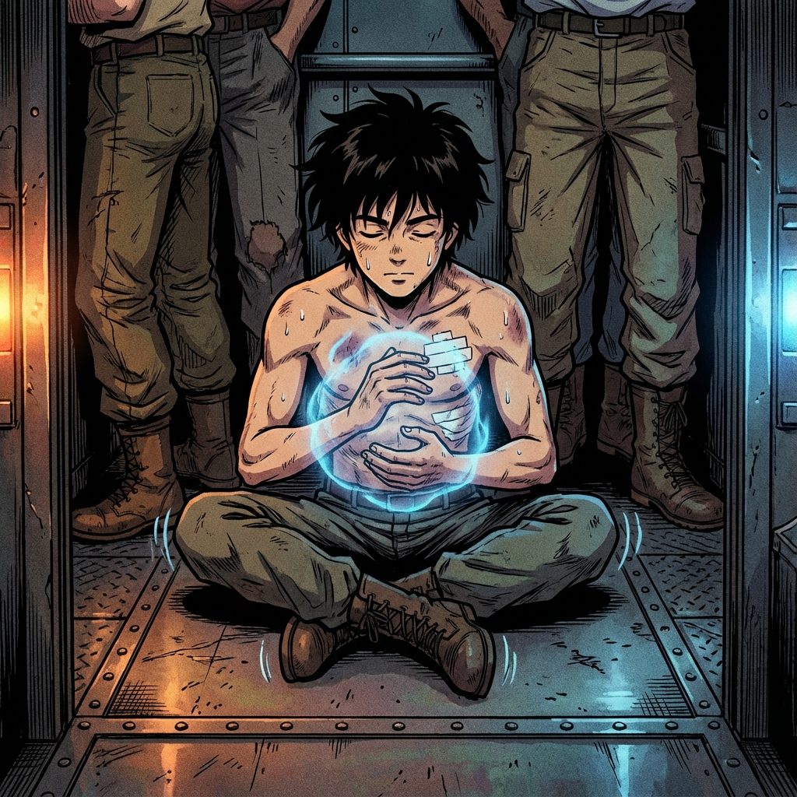

It's faint, like a heartbeat under deep water, but you feel it. A soothing warmth spreads through your chest. The stinging of the burns fades to a dull ache. Your breathing steadies.

**Status Update:**
- **Health**: 80/100 (+10 Recovery)
- **Fatigue**: 40/100 (-20 Rest)

The elevator shudders violently as it hits the upper atmospheric brakes. The darkness of the shaft gives way to blinding, stark white light.

**You have reached the Surface.**

A massive blast door groans open, revealing the **[Imperial Arena Staging Grounds](../codex/locations/Staging_Grounds.md)**.

It is a jungle of concrete and steel, filled with thousands of warriors.

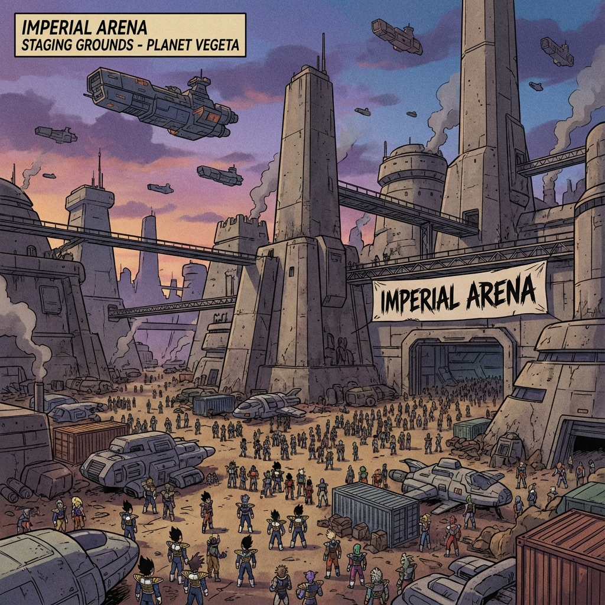

***

You step off the platform into the chaos. The air here tastes different—metallic, charged with ozone and the roar of a million voices. The sky above is a bruised purple, dominated by the massive floating structure of the Royal Box miles away.

Around you, the "Ascended" are being corralled into processing lines. High above, Frieza Force ships dart like wasps.

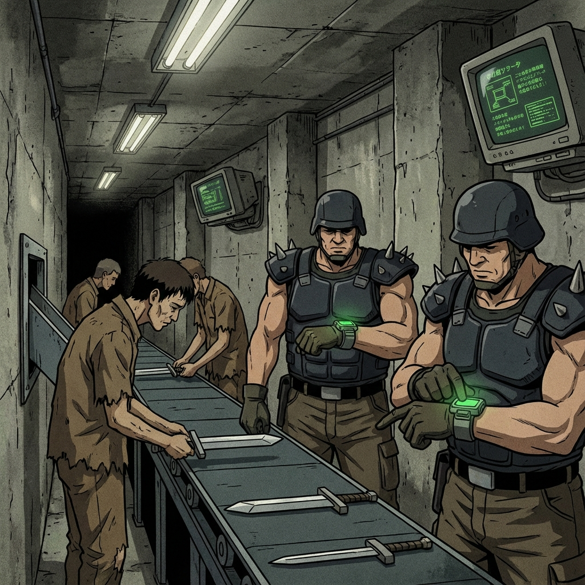

**What do you do?**
(Inspect the competition, Look for weapons/supplies, Try to slip away into the crowd, Find a medic for your burns...)

***

You keep your head down. You conform. You shuffle forward with the mass of bodies, stepping over the weak who collapse from the ascent.

A guard in heavy armor slams a metal scanner against your chest. "Clear," he barks, then shoves something heavy into your hands.

**Acquired: [Rusted Saiyan Blade](../codex/items/Rusted_Saiyan_Blade.md)**

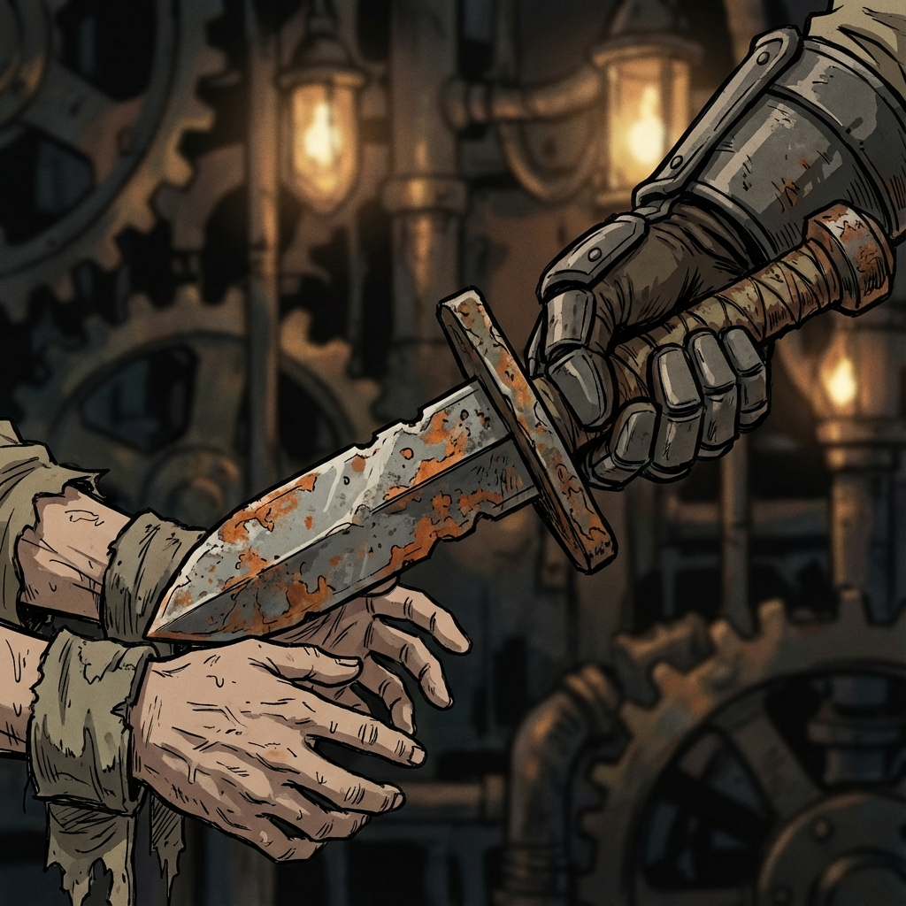

"Squad 7," the guard grunts, shoving you toward a holding pen on the far side of the tarmac. "Move. If you aren't in the pen in five minutes, I shoot you myself."

You grip the rusted iron hilt. It's heavy, unbalanced, and smells of old blood. But it's steel.

**Squad 7** seems to be a motley collection of survivors huddled near a landing pad.

**What do you do?**
(Head to Squad 7, Inspect your new weapon, Hide the weapon and look for a better one...)

***

You step out of the processing line and find a momentary shadow behind a stack of crates. You lift the blade, turning it in the harsh purple light. Your hands are still shaking from the ascent, but your eyes are sharp.

**Skill Check: Intellect (10) vs DC 15 (Material Analysis, Shaky Hands -5)**
> **Result**: Success (Margin +2)

It looks like scrap, but as you thumb the edge, you realize the rust is superficial. The core is high-carbon durasteel. Beneath the grime near the hilt, you find a small, stamped sigil: **"Armory 44 - Rejected."**
It's not broken; it was just ugly. It will hold an edge if you sharpen it.

**Item Updated: [Rusted Saiyan Blade](../codex/items/Rusted_Saiyan_Blade.md)**
- **Hidden Trait**: *Quality Steel* (Durability is Medium, not Low).

Satisfied, you slide the blade into your belt.

**Squad 7** is waiting. A group of four other Saiyans and one massive, insectoid alien are arguing over a map component.

**What do you do?**
(Head to Squad 7, Inspect your new weapon, Hide the weapon and look for a better one...)

***

You approach the landing pad. The argument stops as you get close.

Five heads turn.

**[Zorn](../codex/characters/Zorn.md)**, the Saiyan in the center, steps forward. He has a jagged scar running down his cheek and mismatched armor that looks like it was ripped off a corpse. He looks you up and down, his eyes lingering on your scrawny build and the rusted blade in your belt.

"Well," Zorn spits, "Looks like they're scraping the bottom of the barrel. You the reinforcement?"

Next to him, a large insectoid alien chitters. The vocoder around its neck buzzes.
**[Klik](../codex/characters/Klik.md)**: "Stats... negligible. Biological mass... insufficient. Expected survival time: 4 minutes."

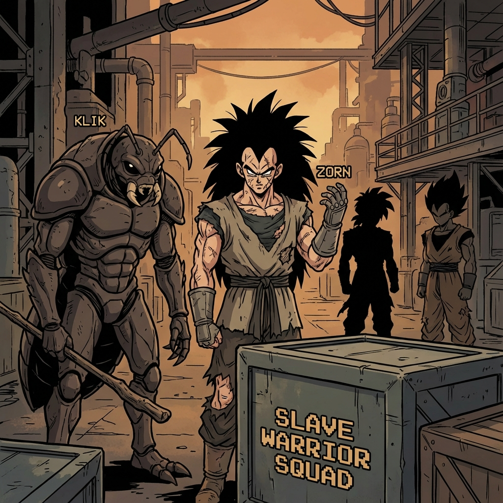

Zorn laughs—a sharp, barking sound. "Four minutes? I give him two."

He steps into your personal space, smelling of ozone and dried sweat.
"Name's Zorn. This is Squad 7. We survive because we aren't dead weight. Prove you aren't dead weight, runt."

**What do you do?**
(Introduce yourself challenge him, Show off your Ki (Skill Check), Stay silent and fall in line, Ask about the mission...)

***

You look him in the eye. "Zorn, it's good to see a face not immediately trying to injure me." you say, calm amidst the chaos. You extend your hand, palm open—a gesture of trust.

**Skill Check: Charisma (10) vs DC 40 (Saiyan Hostility, Poise +5, Alien Gesture -10)**
> **Result**: Failure (Margin -35)

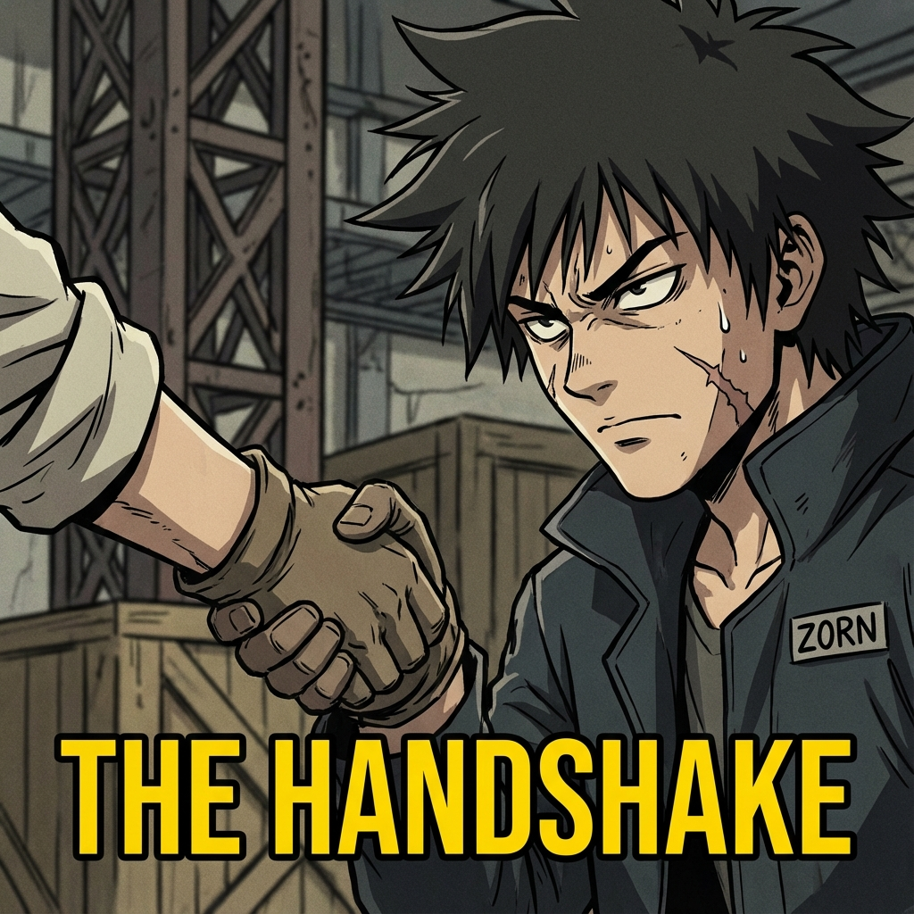

Zorn stares at your open hand like you just offered him a dead rat. The silence stretches, heavy and awkward. The insectoid, Klik, tilts his head, his mandibles clicking in a rhythm that sounds suspiciously like a laugh.

"Injure you?" Zorn snorts, ignoring your hand completely. He turns his back, spitting on the concrete. "I don't waste energy on corpses."

He gestures to the open transport bay behind him.
"Get in the pod, 'Friend'. Unless you want to walk to the orbit."

**Interaction Failed.**
*Saiyans do not shake hands.*

**What do you do?**
(Withdaw the hand and board the pod, Make a retort, Inspect the pod before entering...)

***

You swallow your pride—for now. "What is going on?" you ask, shaking the rejection off your shoulders as you step into the cramped, dark interior of the transport pod.

The air inside is stale, recycled a thousand times. You strap yourself into the crash webbing next to Klik. The insectoid smells like dry leaves and chemicals.

Zorn slams the hatch shut, plunging the squad into red emergency lighting.

"What's going on?" Zorn mimics your voice, his face lit from below by the pod's console. "You really are fresh. We're the entertainment, runt. The **Orbital Prelims**."

Klik's vocoder buzzes. "Logic: 100 Squads orbital insertion. Objective: Secure the Command Spire. Survival probability: 8.4%."

Zorn grins, showing teeth that look too sharp. "100 Squads go in. 10 come out. Then we get to eat."

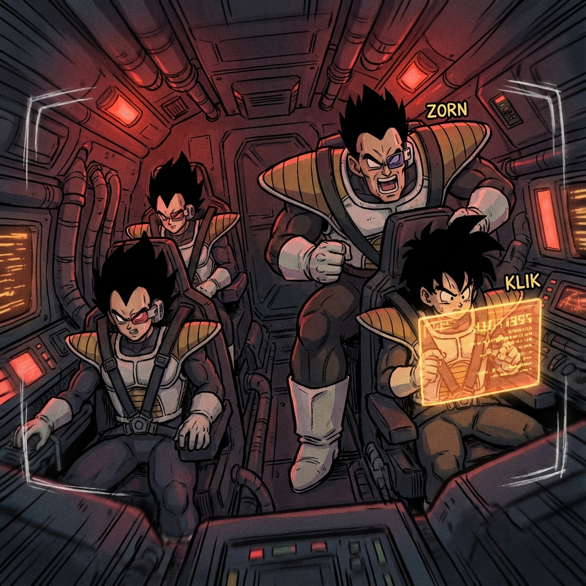

The floor drops out from under you.

**LAUNCH DETECTED.**
G-forces slam you back into your seat. The pod screams upward, punching through the atmosphere.

**Mission Updated:**
- **Objective**: Survive the drop.
- **Squad**: Stick with Zorn and Klik.
- **Target**: The Orbital Arena.

**What do you do during the drop?**

***

"Recover?" Zorn laughs, his voice strained by the crushing G-force. "You recover when you're dead! Brace for impact!"

The viewport screams with reentry fire.

**Skill Check: Endurance (8) + Crash Webbing (10) vs DC 20 (High G Impact)**
> **Result**: Success (Margin +12)

You grit your teeth and force your blood to circulate, fighting the blackout. The pod retros fire—a bone-jarring *THUD*—and you slam into the metal surface of the Orbital Arena.

The hatch explodes outward.

**[Orbital Arena Surface](../codex/locations/Orbital_Arena.md)**
Chaos. Pure chaos. Pods are raining down like meteors, cratering the metallic city-scape. Explosions rock the ground.

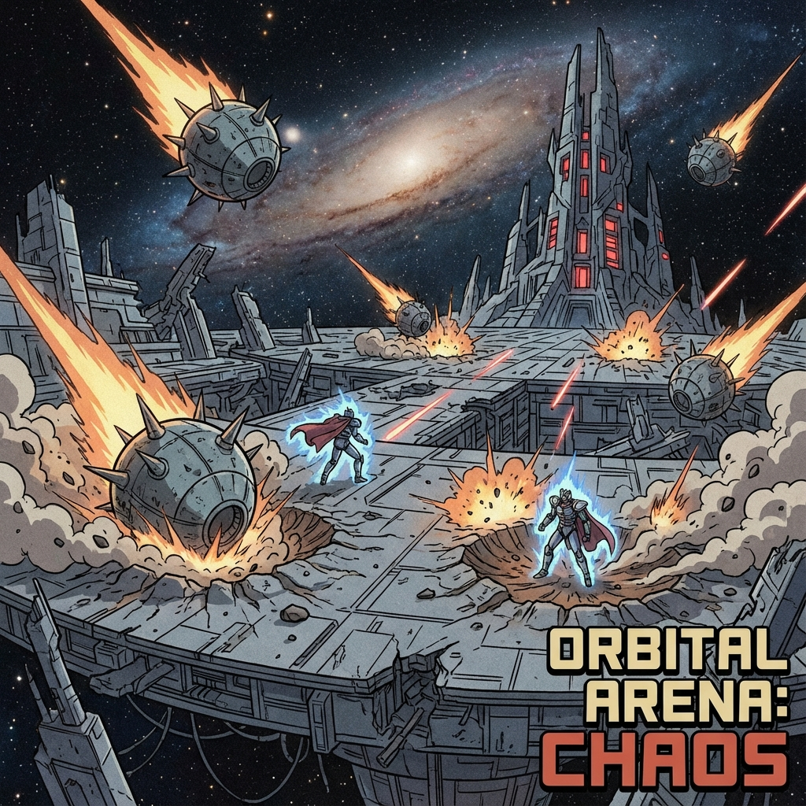

You stumble out, weapon drawn. Zorn lands next to you, shaking debris from his hair.
"Move! We're sitting ducks in the crater! To the Command Spire!"

Klik parses the battlefield. "Analysis: Enemy squad detecting in Sector 3. Distance: 50 meters. Closing."

**What do you do?**
(Follow Zorn to the Spire, Ambush the closing enemy squad, Look for high ground...)

***

You don't hesitate. You scramble out of the crater, boots skidding on the hot metal. Zorn is already moving, a blur of motion weaving through the twisted wreckage.

"Keep up, runt!" he bellows.

Ki blasts from the enemy squad sizzle through the air, melting slag off the walls inches from your head.

**Skill Check: Agility (8) vs DC 15 (Debris Field -5, Adrenaline +2)**
> **Result**: Success (Margin +3)

You dive under a collapsed beam, scramble over a pile of crushed pods, and slide into a narrow ravine. Zorn is there, chest heaving. Klik skitters down the wall a second later.

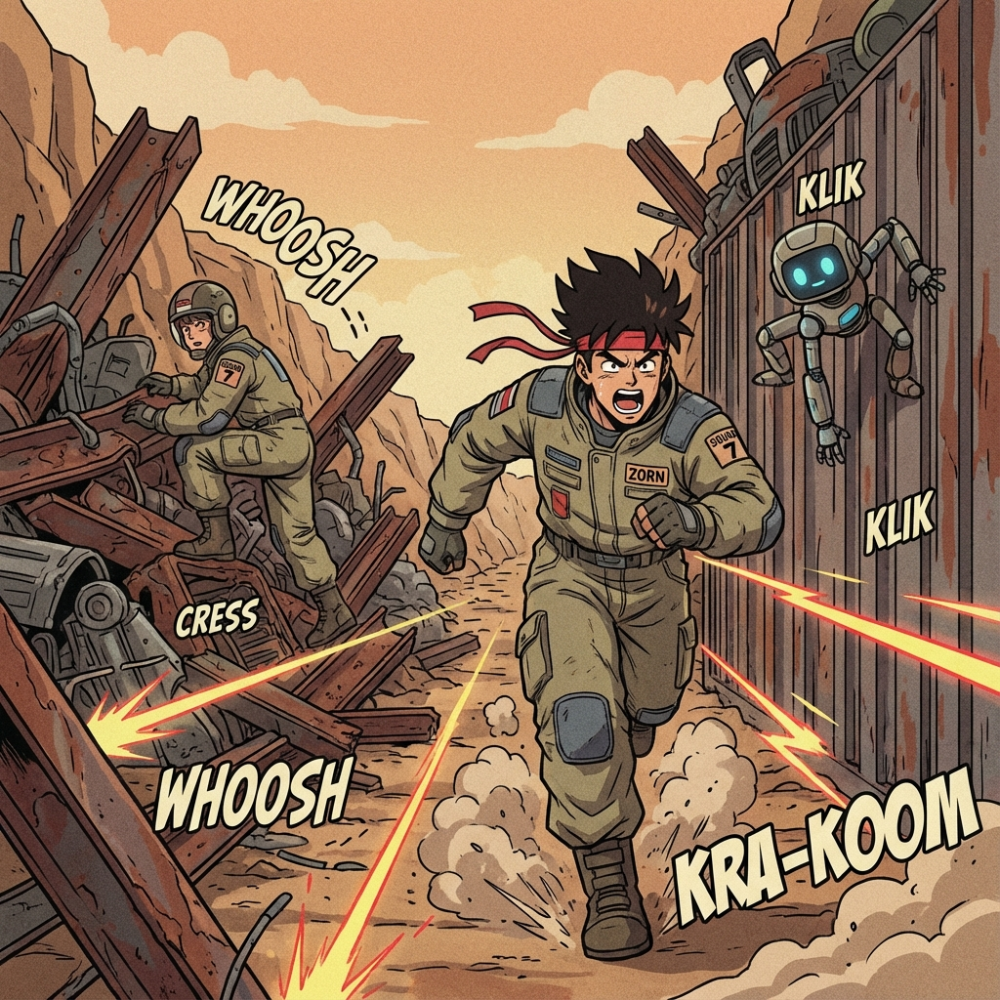

You are in a **Ruined Bunker**. It's dark, defensible, and smells of old death.

Zorn checks his scouter. "Lost them. For now."

He turns to the squad. "We need to hit the Spire before the Elites lock it down. But we're light weapon-wise."

Klik projects a holographic map.
"Option A: Supply Depot Alpha. High risk. High reward."
"Option B: The Maintenance Tunnels. Low risk. Slow."

**What do you do?**
(Vote for Depot (Guns), Vote for Tunnels (Stealth), Stay silent let Zorn decide...)

***

"Why?" You look at the map. "What's at the Spire?"

Zorn looks at you like you're an idiot, but Klik answers before the Saiyan can swear at you.

"Objective Parameters," the insectoid clicks. "The 'Prelims' are a suppression field exercise. The Field is shrinking. Safe Zone is the Command Spire. Anyone outside the Spire when the timer hits zero..." Klik makes a crushing gesture with his three-fingered hand. "...is compacted."

Zorn points a jagged fingernail at the massive tower looming over the horizon. "It's King of the Hill, runt. We take the Spire, we hold it against the other 90 squads, and we survive to the finals. We stay here, we get crushed."

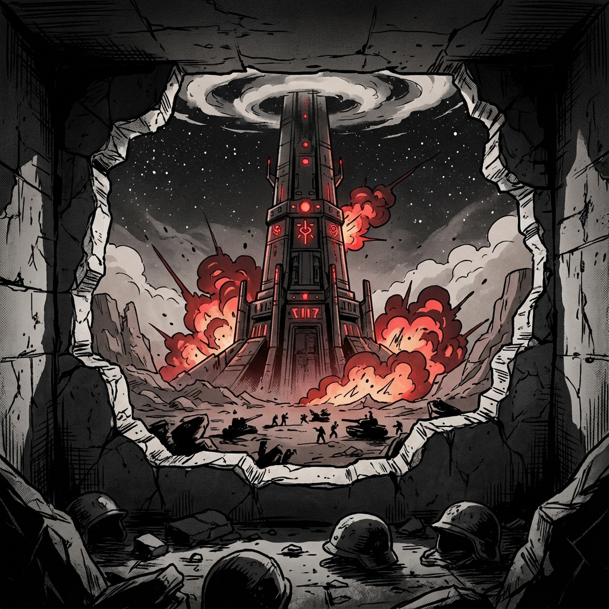

"So," Zorn growls. "Guns or Tunnels? Pick one. My patience is ticking down faster than the field."

**The Choice remains:**
(Vote for Depot (Guns), Vote for Tunnels (Stealth)...)

***

"Tunnels. My energy is far more powerful than the guns!" you declare, letting a spark of ki dance across your palm.

Zorn stops. The Crimson Saiyan looks at you, then punches a button on his scouter.
"Reading..." he drones. "Power Level... 5."

He snorts, a harsh barking sound. "Yeah. Terrifying. You're a regular Super warrior. We're taking the tunnels, but only because I don't want to carry your corpse out of the Depot when you try to 'energy blast' a tank."

He kicks open a rusted grate in the floor. "Ladies first, 'Energy Master'."

**[Maintenance Tunnels](../codex/locations/Maintenance_Tunnels.md)**

You drop into the darkness. The heat hits you instantlymoist, cloying heat that smells of ozone and rot.

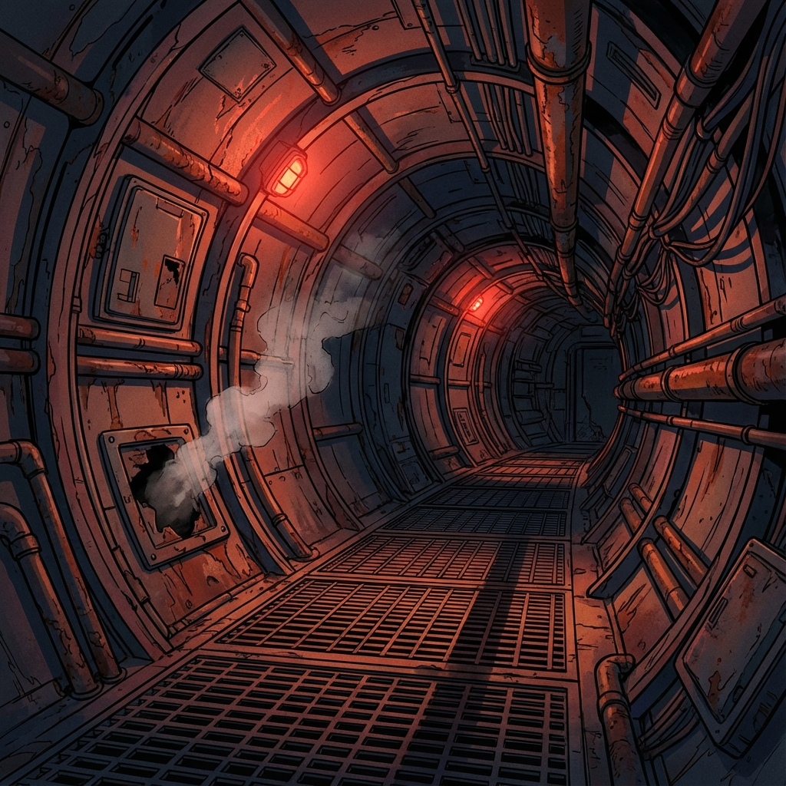

The tunnels are a claustrophobic nightmare of hissing pipes and dripping coolant. The sounds of the surface war are muffled here, replaced by the rhythmic thrumming of the Arena's power systems.

"Analysis," Klik chirps, his mechanical legs skittering on the metal grating. "Path to Command Spire is clear. However. Obstruction detected 200 meters ahead."

You reach the obstruction. A massive section of the ceiling has collapsed, filling the corridor with twisted girders and concrete slab.

Zorn crosses his arms, leaning against a dripping pipe. He gestures to the blockage with his chin.
"Well?" he sneers, looking at you. "You said your energy was powerful. Clear the path, runt. Or are we climbing?"

**What do you do?**
(Attempt to Blast the wreckage (Ki Blast), Attempt to Lift the wreckage (Strength), Ignore Zorn and look for a bypass...)

***

You smirk, channeling your inner warrior. You point a finger at the center of the blockage, visualizing a razor-sharp beam that will carve through the concrete like parchment.

"Watch and learn," you say.

**Skill Check: Ki Control (1) vs DC 18 (Precision Beam)**
> **Result**: Critical Failure (Natural 1)

You focus. You grunt. The air around your finger begins to shimmer. A tiny red bead of energy forms... wavers... and then

*Pfhhht.*

A pathetic puff of smoke spirals up from your fingertip. The bead of energy simply evaporates, leaving a smell of burnt ozone and your own embarrassment hanging in the damp air.

Zorn stares at your finger. Then at the wall. Then back at you.

He doesn't even laugh. That's almost worse. He just shakes his head, a look of profound disappointment on his face.
"Impressive," he deadpans. "You managed to threaten the darkness with a nightlight."

Klik's optical sensors rotate. "Observation: Energy output negligible. Structural integrity of obstruction: 100%. Probability of clearing via this method: 0%."

Zorn shoves past you, his shoulder checking you into the wall. "Out of the way, 'Master'. I'll handle the heavy lifting. You... watch the rear. Try not to hurt yourself."

Zorn grabs a rusted pipe jutting from the wreckage. Muscles in his back coil like snakes beneath his armor. With a roar, he **heaves**.
The wreckage groans, shifts, and then collapses *outward*, creating a gap just big enough to squeeze through.

"Move," he barks.

**[Codex Updated: Zorn (Status: Unimpressed)](../codex/characters/Zorn.md)**

You scramble through the gap, face burning. The tunnel widens ahead into a junction.

"Left: Cooling Systems," Klik announces. "Right: Waste Disposal."
"Cooling Systems is faster," Zorn says, "but Waste Disposal is..." He sniffs the air. "Actually, they both smell like death."

Suddenly, Klik freezes. "Motion detected. Multiple distinct signatures. Skittering."

From the darkness of the **Waste Disposal** tunnel, you see eyes. Dozens of glowing red eyes.

**What do you do?**
(Suggest the Cooling Systems immediately, Draw your Rusted Blade and prepare to fight the 'eyes', Ask Klik for a scan of the creatures...)

***

You close your eyes, ignoring the visual chaos, and extend your senses into the dark. *Feel them.*

**Skill Check: Ki Control (1) + Saiyan Instinct vs DC 15**
> **Result**: Partial Success (11)

You don't get exact numbersit's just a fuzzy static of hunger and malicebut you feel the *intent*.
These aren't soldiers. They're animals. Desperate. Starving. And they are all around you.

"Hunger," you whisper. "They're feeding."

**[Codex Updated: Feral Saibaman](../codex/characters/Feral_Saibaman.md)**

Zorn scoffs. "Feeding where?"

*SCREEE!*

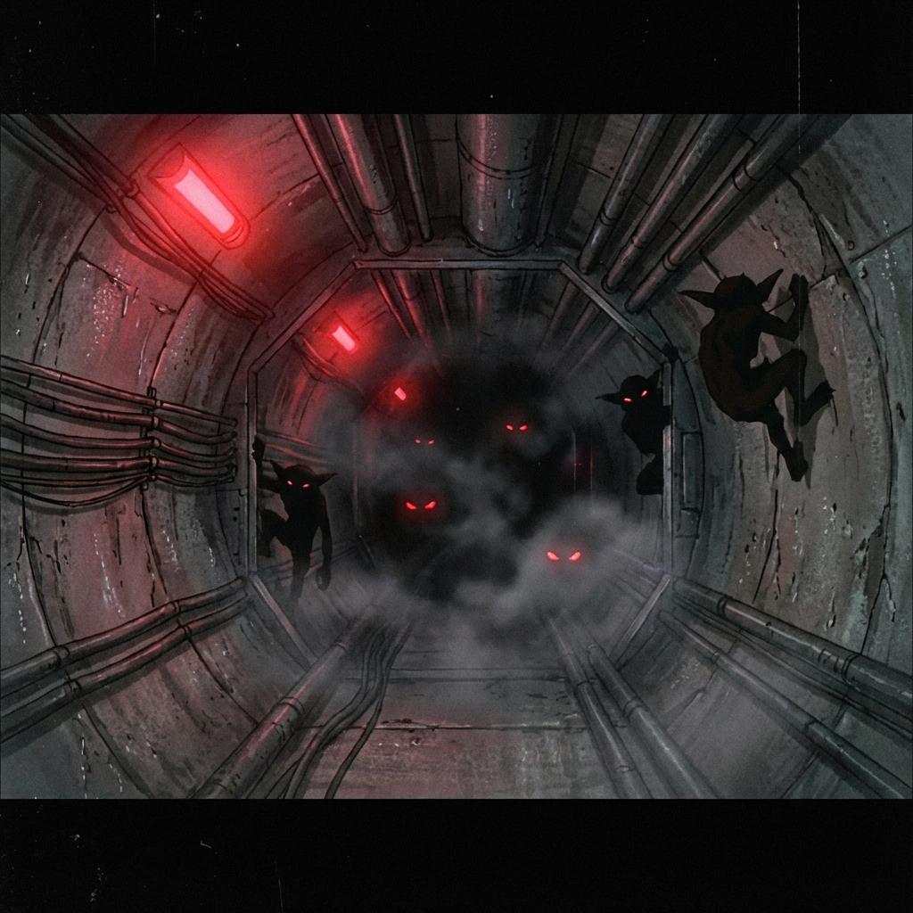

Six hunched, green figures drop from the ceiling pipes, landing in a circle around the squad. Their claws click on the grating. Acid drools from their jaws, sizzling where it hits the metal.

"Specimen ID: Feral Saibamen," Klik drones. "Rejected bio-stock. Power Level: 60. Threat: Minimal individually. Moderate in swarm."

One of the creatures lunges at you, claws leading!

**Initiative!**
- **Zorn**: 18
- **Feral Saibamen**: 14
- **You**: 12
- **Klik**: 10

Zorn moves first. *SNAP*. He backhands a Saibaman mid-air, sending it careening into a steam pipe with a wet crunchy sound. It doesn't get up.
"Trash," he spits.

But three more are rushing **You**.

**What do you do?**
(Defend/Block (Strength), Counter-Attack with Blade (Weapon), Dodge and let them hit the wall (Agility)...)

***

"Burn!" you yell, thrusting your palms down and unleashing a wave of energy.

**Skill Check: Ki Control (1) vs DC 15 (Melt Floor)**
> **Result**: Failure (Rolling 6 + 1 = 7)

The floor doesn't melt. The reinforced plasteel grating barely warms up. Instead, your blast hits the surface and *shatters*, erupting into a blinding sphere of pure white light.

**Effect**: **Flashbang!**
*Feral Saibamen Weakness Triggered: Photosensitivity.*

The tunnel is bleached white for a second. The impact force is negligible, but the *light* is devastating to the cave-dwelling creatures.
The three Saibamen attacking you shriek, clawing at their own eyes. They tumble backward, hissing and spitting acid blindly at the walls.

Zorn shields his eyes with a curse. "Gah! Warning next time, idiot!"
But he seizes the opening. While the other three are distracted by the flash, he snaps another one's neck.

Klik: "Tactical Assessment: Enemy sensory organs overloaded. Opportunity window: 5 seconds."

You have bought yourself a moment. The three in front of you are writhing on the ground, blinded but furious.

**What do you do?**
(Finish them off with your Blade (Guaranteed Hit), Use the confusion to Sprint past them, Attempt to grab one and throw it at the others...)

