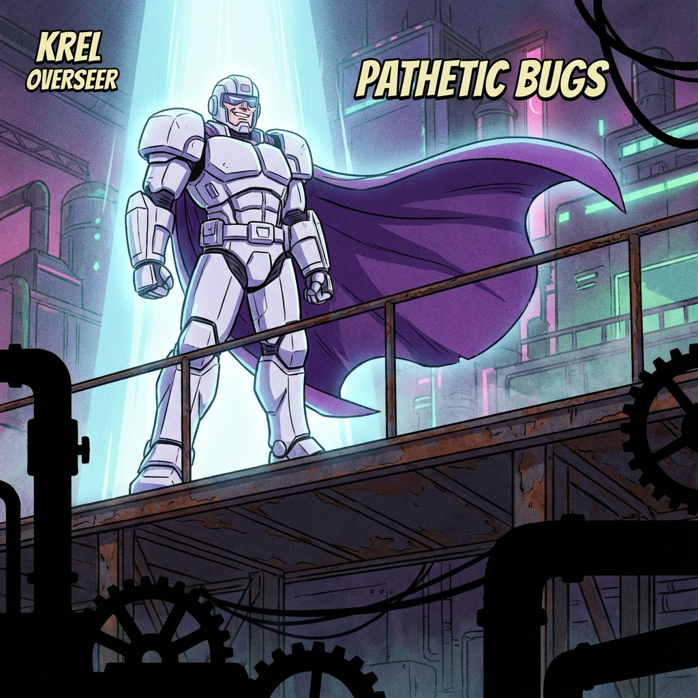
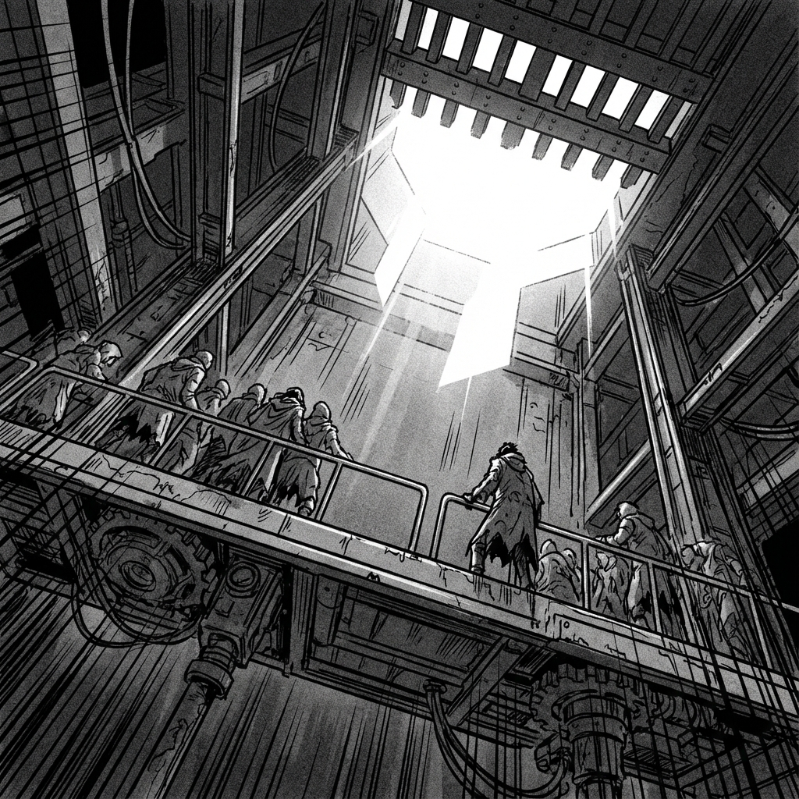
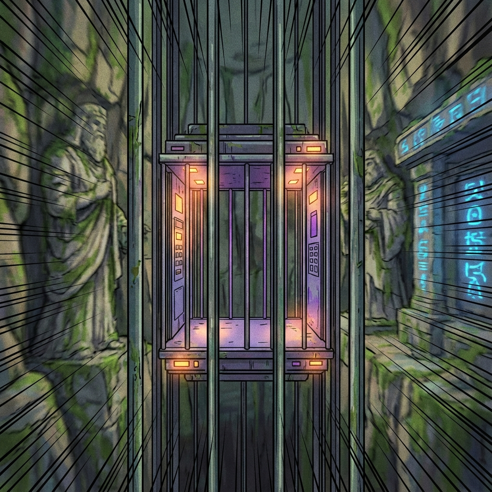
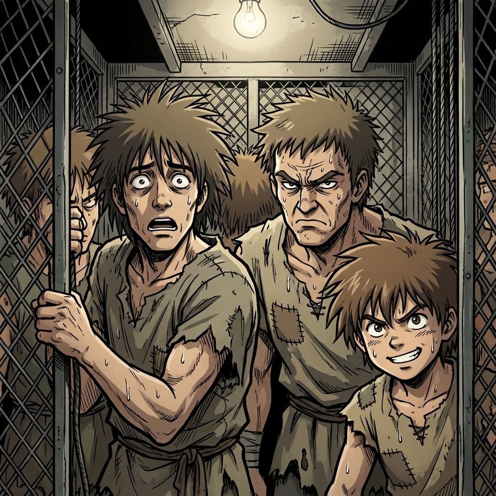

# Session 2: The Ascension

***

**Status Update:**
- **XP**: 50 (Unspent)
- **Health**: 70/100 (Bacta-Foam Recovery)
- **Fatigue**: 60/100 (Still exhausted, but adrenaline is fading)

The Saibaman's corpse is dragged away, leaving a smear of green blood on the stones. You are shoved onto the central platform along with fifty other survivors.

**Elite Overseer Krel** steps onto a higher, shielded platform. He looks down at the group with his trademark boredom.

"Phase One complete," he announces, his voice amplified by the pit acoustics. "You have proven you can kill mindless beasts. Now, you will prove if you are worthy to serve the Empire."

The platform shudders. Massive gears groan beneath your feet.

**The Ascent begins.**

Slowly at first, then with bone-rattling speed, the elevator begins to rise. The crimson light of the slave pens recedes, replaced by the rushing darkness of the shaft.

Through the gaps in the cage, you see the planet's history flashing by—massive ancient stone ruins and carvings buried deep in the crust, illuminated briefly by the sparks of the lift's passage.

Wind whips at your tattered tunic. You look around at the other survivors. Faces are gaunt, terrified, or—in a few rare cases—excited.

**What do you do during the ascent?**
(Rest/Meditate, Inspect the other slaves, Talk to someone, Look for an escape route...)
