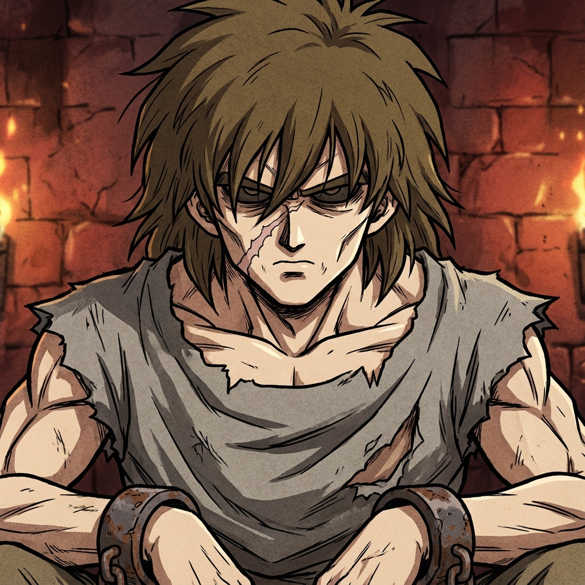

# Cress (The Protagonist)

A Slave Class Saiyan born into the dust of the Arena. Malnourished but hiding a burning potential.

**Physical Description:**
Cress has a sharp, angular face with hollow cheeks from years of malnutrition. His hair is a matted, choppy mess of brown (not black) that hangs over his eyes, lacking the defiant spikes of purebred warriors. A jagged, pale scar runs diagonally across the bridge of his nose—a gift from a guard's whip. His eyes are a dull onyx, burning with a quiet, suppressed rage. He wears a tunic stitched together from grey industrial scraps, and his wrists are bound in heavy, rusted iron shackles that chafe his skin.

**Current Stats:**
- **Power Level**: 5
- **Class**: Slave Class
- **Status**: Starving, Shackled
- **Equipment**: Tattered Tunic, Iron Shackles (Training Weights)

**Abilities:**
- **Brawling**: Level 5 (Learned in the pits)
- **Endurance**: Level 15 (Learned from Nappa's beatings)

**History:**
Born to unknown parents who died in the arena. Raised by the other slaves. Dreams of breaking the chains and ascending to the stars.
