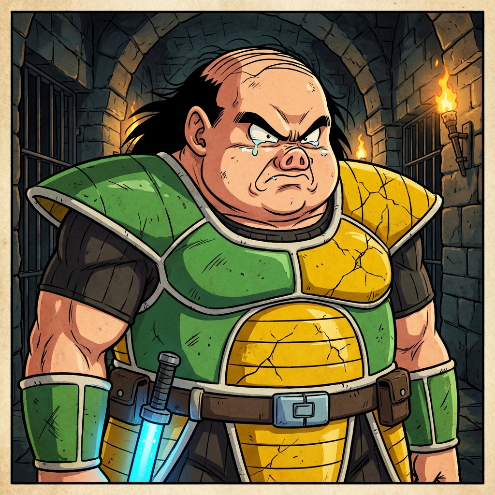

# Warden Nappa (Slave Overseer)

**(Not the General Nappa)**
A distant relative of the elite Nappa, sharing the surname but little else.

**Physical Description:**
He is a hulking wall of muscle, but gone to fat around the gut. unlike his famous relative, he is not bald by choice but has a receding hairline of wispy black hair. His face is broad and piggish, with a smashed nose and small, watery eyes. He wears a mish-mash of old armor plates—a green chest piece that's too small, and cracked yellow shoulder pads. A shock baton hangs from a rusted chain at his belt.

**Stats:**
- **Power Level**: 4,000 (Elite compared to slaves, trash compared to the army)
- **Disposition**: Cruel, Sadistic, Lazy
- **Equipment**: Standard Saiyan Armor (Old model), Shock Baton

**Notes:**
- Has a gambling habit.
- Dislikes "uppity" slaves.
